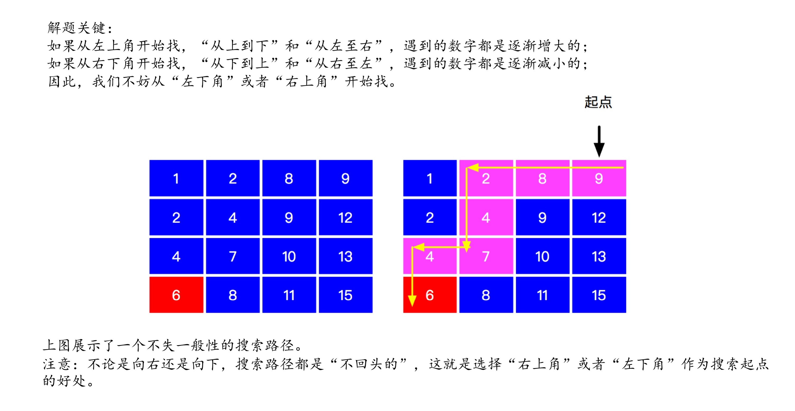
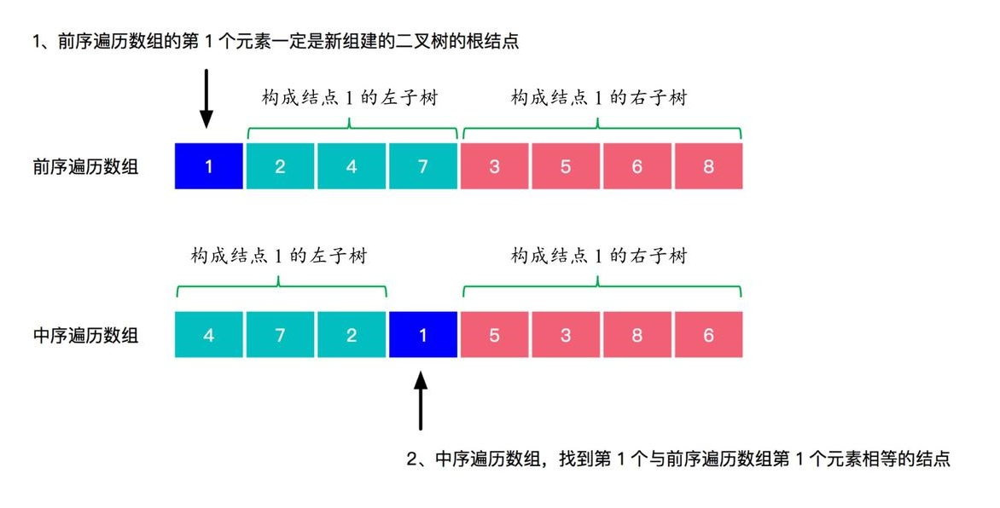
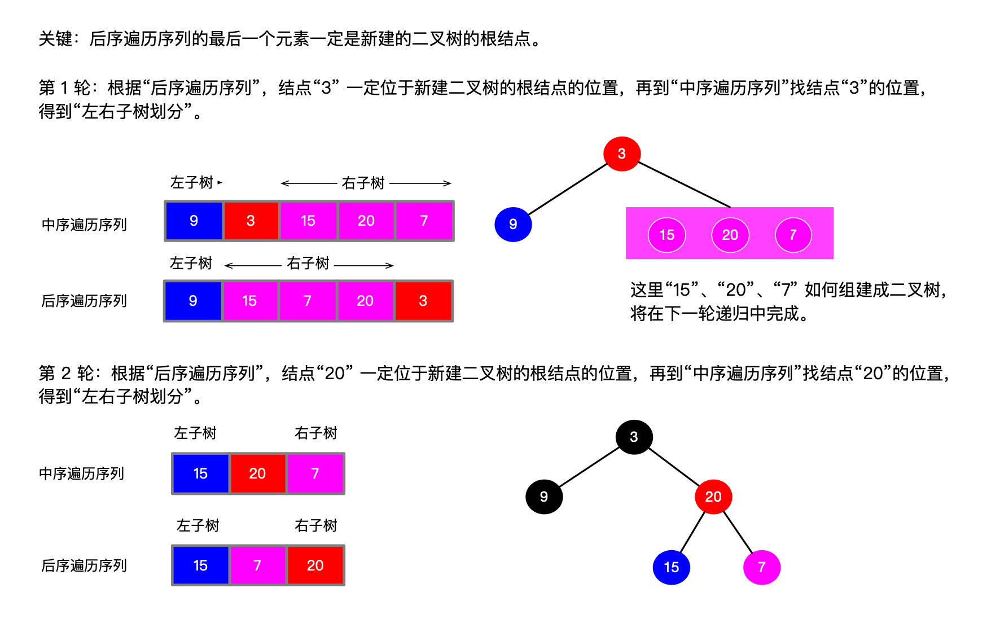

# 动态规划

## 题目53 — 

给定一个整数数组 nums ，找到一个具有最大和的连续子数组（子数组最少包含一个元素），返回其最大和。

**示例:**

> 输入: [-2,1,-3,4,-1,2,1,-5,4],
> 输出: 6
> 解释: 连续子数组 [4,-1,2,1] 的和最大，为 6。

**进阶:** 如果你已经实现复杂度为 O(n) 的解法，尝试使用更为精妙的分治法求解。

### 答案

#### 思路

1. 定义状态: dp[i] 为数组 [0…i]中的最大和, 一定包含dp[i]

   > 注意是连续子数组, 所以必须包含最后一个元素, 否则就断了

2. 定义输出: dp[]中最大的值

3. 状态转移方程:  `dp[i] = dp[i - 1] >= 0 ? dp[i - 1] + nums[i] : nums[i]`

###### 代码

```java
public int maxSubArray(int[] nums) {
    int[] dp = Arrays.copyOf(nums, nums.length);

    int res = dp[0];
    for (int i = 1; i < nums.length; i++) {
        dp[i] = dp[i - 1] >= 0 ? dp[i - 1] + nums[i] : nums[i];
        res = Math.max(dp[i], res);
    }
    return res;
}
```


## 题目239 — 滑动窗口的最大值

给定一个数组 nums，有一个大小为 k 的滑动窗口从数组的最左侧移动到数组的最右侧。你只可以看到在滑动窗口内的 k 个数字。滑动窗口每次只向右移动一位。

返回滑动窗口中的最大值。

**示例:**

```
输入: nums = [1,3,-1,-3,5,3,6,7], 和 k = 3
输出: [3,3,5,5,6,7] 
解释: 

  滑动窗口的位置                最大值

[1  3  -1] -3  5  3  6  7       3
 1 [3  -1  -3] 5  3  6  7       3
 1  3 [-1  -3  5] 3  6  7       5
 1  3  -1 [-3  5  3] 6  7       5
 1  3  -1  -3 [5  3  6] 7       6
 1  3  -1  -3  5 [3  6  7]      7 
```

**提示：**你可以假设 k 总是有效的，在输入数组不为空的情况下，1 ≤ k ≤ 输入数组的大小。

### 答案

#### 思路

只将有可能成为滑动窗口中的最大值的元素入列

使用双端队列，**队列头永远存放当前滑动窗口的最大值，而队列尾存放候选最大值，即当队列头的最大值弹出后成为新的最大值的那些元素**。

#### 实例描述

1. 一开始2进入队列，然后3进入队列，因为3比2大，所以2不可能是滑动窗口的最大值。因此先将2从队列中弹出，然后3入列；接下来4入列也类似：将3弹出，4入列，目前队列中只有一个元素，且滑动窗口中已经有三个数字了，所以此时窗口中的最大值是位于队列头的4。
2. 接下来2入列，虽然比4小，但是不知道什么时候4将会位于滑动窗口之外，所以这个2还是有一定可能成为窗口中的最大值的，应该将其入列，注意应该排在队列的尾部，因为队列头始终是当前窗口的最大值。由于队列头还是4，所以此时窗口中的最大值还是4。
3. 然后6入列，队列中的4和2都不可能成为窗口中的最大值了，因此应该先从队列中弹出4和2然后再将6入列....后面的分析也大同小异。
4. ......
5. 再看最后一个元素1，它入列前，队列中有6和5，且6位于队列头是窗口中的最大值，按照之前的做法，应该将1入列，但是窗口的大小为3，此时队列头的6已经在窗口之外了，所以要讲6从队列中弹出，那么此时队列中还剩下5和1且5位于队列头，所以最后一个窗口中的最大值是5。

**那么如何判断某个元素还在不在窗口内呢？我们应该在往队列中存元素的下标而不是元素本身。**若当前正访问的元素的下标与窗口最大值的下标（即队列头元素的下标）超过了窗口的宽度，就应该从队列头删除这个在滑动窗口之外的最大值。

#### 视频解析

[参考 leetcode题解视频解析](https://leetcode-cn.com/problems/sliding-window-maximum/solution/shi-pin-jie-xi-shuang-duan-dui-lie-hua-dong-chuang/)

#### 总结

- 即将要入列的的元素比队列中哪些元素大或者相等，就将那些元素先从队列中删除，然后再入列新元素；
- 队列头的最大值如果位于滑动窗口之外，则需要将队列头的最大值从队列中删除；
- 当前下标加上1（因为下标从0开始计）等于窗口宽度的时候就可以开始统计滑动窗口的最大值了

###### 代码

```java
public class Pro239 {
    public int[] maxSlidingWindow(int[] nums, int k) {
        int len = nums.length;
        if (len == 0) return new int[]{};

        List<Integer> res = new ArrayList<>();
        // 滑动窗口(双端队列)，注意：保存的是索引值
        ArrayDeque<Integer> deque = new ArrayDeque<>(k);

        for (int i = 0; i < len; i++) {

            // 添加下标 i后, 队列中的数目 > 窗口宽度, 将队首元素弹出
            if (i >= k && i - deque.getFirst() == k)
                deque.pollFirst();

            // 如果滑动窗口非空，新进来的数比队列里已经存在的数还要大, 则说明已经存在数一定不会是滑动窗口的最大值, 将它们弹出
            // 例子: 滑动窗口为[5, 3, 2], 添加元素为 4, 循环完后变成 [5, 4]
            while (!deque.isEmpty() && nums[i] >= nums[deque.peekLast()])
                deque.pollLast();

            // 将元素添加到队列中, 注意是添加下标
            deque.add(i);
            // 保证队列中的元素值 >= 窗口宽度, 队首一定是滑动窗口的最大值的索引
            if (i + 1 >= k)
                res.add(nums[deque.peekFirst()]);

        }

        // 赋值操作
        int size = res.size();
        int[] result = new int[size];

        for (int i = 0; i < size; i++)
            result[i] = res.get(i);

        return result;
    }
}
```


## 题目 155 — 最小栈

设计一个支持 push，pop，top 操作，并能在常数时间内检索到最小元素的栈。

* push(x) -- 将元素 x 推入栈中。
* pop() -- 删除栈顶的元素。
* top() -- 获取栈顶元素。
* getMin() -- 检索栈中的最小元素。

**示例:**

```
MinStack minStack = new MinStack();
minStack.push(-2);
minStack.push(0);
minStack.push(-3);
minStack.getMin();   --> 返回 -3.
minStack.pop();
minStack.top();      --> 返回 0.
minStack.getMin();   --> 返回 -2.
```

### 答案

#### 思路一

使用辅助栈, 辅助站和数据栈同步

**要点:** 要确保在辅助站中的栈顶元素永远是此时数据栈的最小值, 具体见代码

###### 代码

```java
// 题解, 数据栈和辅助栈在任何时候都同步
class MinStack {

    private Stack<Integer> data;    // 数据栈
    private Stack<Integer> helper;  // 辅助栈

    // 构造函数初始化栈
    public MinStack() {
        data = new Stack<>();
        helper = new Stack<>();
    }

    public void push(int x) {
        // 数据栈和辅助栈一定会增加元素
        data.add(x);
        // 确保在辅助站中的栈顶元素永远是此时数据栈的最小值
        if (helper.isEmpty() || x <= helper.peek())
            helper.add(x);
        else
            helper.add(helper.peek());
    }

    public void pop() {
        helper.pop();
        data.pop();
    }

    public int top() {
        return data.peek();
    }

    public int getMin() {
        return helper.peek();
    }
}
```


#### 思路一

使用辅助栈, 辅助站和数据栈**不同步**

**要点:** 要确保在辅助站中的栈顶元素永远是此时数据栈的最小值, 具体见代码

* 关键 1：辅助栈的元素空的时候，必须放入新进来的数
* 关键 2：新来的数小于或者等于辅助栈栈顶元素的时候，才放入（特别注意这里等于要考虑进去）
* 关键 3：出栈的时候，辅助栈的栈顶元素等于数据栈的栈顶元素，才出栈，即"出栈保持同步"就可以了

###### 代码

```java
// 题解, 数据栈和辅助栈不同步
class MinStack {

    private Stack<Integer> data;
    private Stack<Integer> helper;

    public MinStack() {
        data = new Stack<>();
        helper = new Stack<>();
    }

    public void push(int x) {
        data.add(x);
        // 关键 1 和 关键 2
        if (helper.isEmpty() || x <= helper.peek())
            helper.add(x);
    }

    public void pop() {
        int res=data.pop();
        if(res==helper.peek()){
            helper.pop();
        }
    }

    public int top() {
        return data.peek();
    }

    public int getMin() {
        return helper.peek();
    }
}
```


## 题目240 — 搜索二维矩阵 II

编写一个高效的算法来搜索 m x n 矩阵 matrix 中的一个目标值 target。该矩阵具有以下特性：

* 每行的元素从左到右升序排列。
* 每列的元素从上到下升序排列。

**示例:**

```
现有矩阵 matrix 如下：
[
  [1,   4,  7, 11, 15],
  [2,   5,  8, 12, 19],
  [3,   6,  9, 16, 22],
  [10, 13, 14, 17, 24],
  [18, 21, 23, 26, 30]
]

给定 target = 5，返回 true。
给定 target = 20，返回 false。
```

### 答案

同剑指 offer第 4题

#### 思路



###### 代码

```java
public boolean searchMatrix(int[][] matrix, int target) {

    // 特殊值判断, matrix = []
    if (matrix == null || matrix.length == 0) return false;
    int row = matrix.length;
    int col = matrix[0].length;

    // 左上角元素的下标
    int x = 0;
    int y = col - 1;
    // 从左上角开始寻找, 并且保证查找元素位于数组内
    while (x >= 0 && x < row && y >= 0 && y < col) {
        if (target > matrix[x][y]) {
            x++;
        } else if (target < matrix[x][y]) {
            y--;
        } else {    // target = array[x][y]
            return true;
        }
    }
    return false;
}
```


## 题目74 — 搜索二维矩阵


## 题目105 — 从前序与中序遍历序列构造二叉树

根据一棵树的前序遍历与中序遍历构造二叉树。

**注意:** 你可以假设树中没有重复的元素。

例如，给出

```
前序遍历 preorder = [3,9,20,15,7]
中序遍历 inorder = [9,3,15,20,7]
```

返回如下的二叉树：

```
    3
   / /
  9  20
    /  /
   15   7
```

### 答案

根据前序遍历和中序遍历的特点, 找到规律



###### 代码

```java
public class Pro105 {
    // 程序入口
    public TreeNode buildTree(int[] preorder, int[] inorder) {
        TreeNode root = buildTree(preorder, 0, preorder.length - 1, inorder, 0, inorder.length - 1);
        return root;
    }


    // 递归, 语义: 创建以 node为根节点的树
    private TreeNode buildTree(int[] pre, int preL, int preR, int[] in, int inL, int inR) {

        // 返回空树
        if (preL > preR || inL > inR) return null;

        // node节点的值
        int nodetVal = pre[preL];
        TreeNode node = new TreeNode(nodetVal);
        // 找到对应的中序遍历中的node节点的值位置
        int inNodePos = inL;
        while (in[inNodePos] != nodetVal && inNodePos <= inR) {
            inNodePos++;
        }

        // 左子树的长度
        int leftLen = inNodePos - inL;
        // 找好位置, 很关键
        node.left = buildTree(pre, preL + 1, preL + leftLen, in, inL, inNodePos - 1);
        node.right = buildTree(pre, preL + leftLen + 1, preR, in, inNodePos + 1, inR);

        return node;
    }
}
```


## 题目106 — 从中序与后序遍历序列构造二叉树

根据一棵树的中序遍历与后序遍历构造二叉树。

**注意:** 你可以假设树中没有重复的元素。

例如，给出

```
中序遍历 inorder = [9,3,15,20,7]
后序遍历 postorder = [9,15,7,20,3]
```

返回如下的二叉树：

```
    3
   / /
  9  20
    /  /
   15   7
```

### 答案

根据后序遍历和中序遍历的特点, 找到规律



###### 代码

```java
public class Pro106 {

    // 程序入口
    public TreeNode buildTree(int[] inorder, int[] postorder) {
        TreeNode root = buildTree(postorder, 0, postorder.length - 1, inorder, 0, inorder.length - 1);
        return root;
    }

    // 递归, 语义: 创建以 node为根节点的树
    private TreeNode buildTree(int[] post, int postL, int postR, int[] in, int inL, int inR) {

        // 返回空树
        if (postL > postR || inL > inR) return null;

        // node节点的值
        int nodetVal = post[postR];
        TreeNode node = new TreeNode(nodetVal);
        // 找到对应的中序遍历中的 node节点的值位置
        int inNodePos = inL;
        while (in[inNodePos] != nodetVal && inNodePos <= inR) {
            inNodePos++;
        }

        // 左子树的长度
        int leftLen = inNodePos - inL;
        // 找好位置, 很关键
        node.left = buildTree(post, postL, postL + leftLen - 1, in, inL, inNodePos - 1);
        node.right = buildTree(post, postL + leftLen, postR - 1, in, inNodePos + 1, inR);

        return node;
    }
}
```


