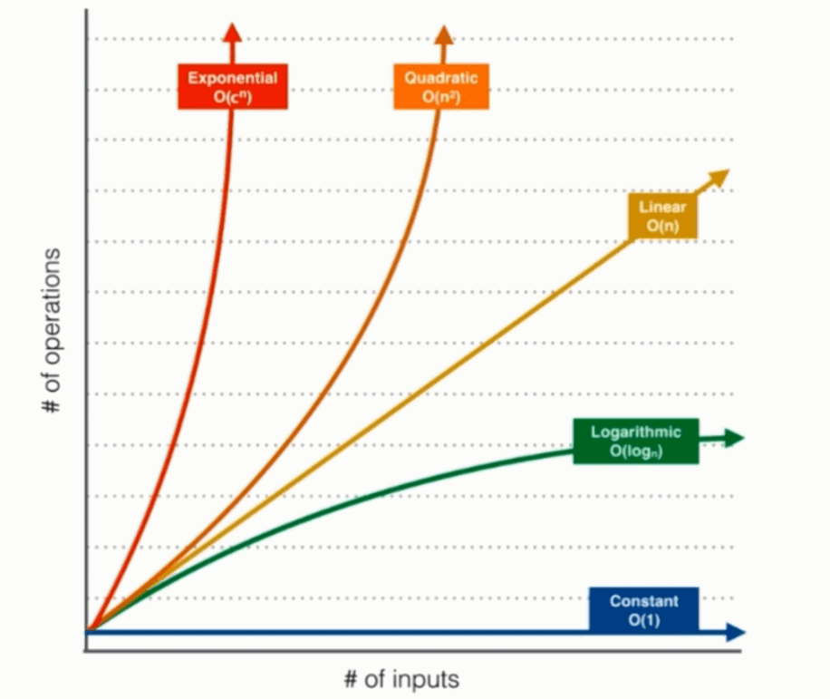
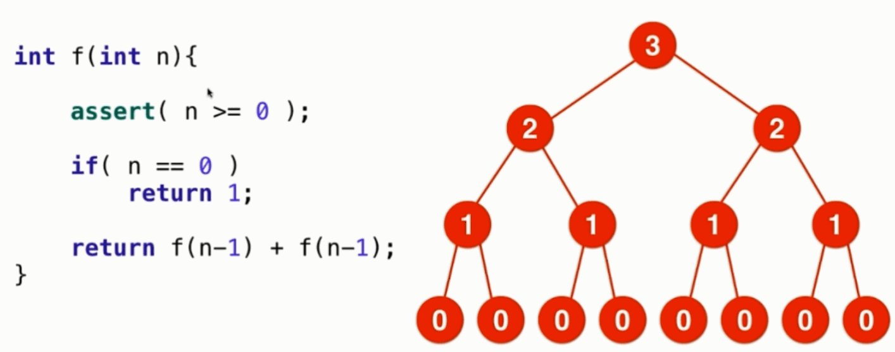

# 面试中的时间复杂度分析

## 一. 究竟什么是大 O

n表示数据规模

O(f(n))表示运行算法所需要执行的指令数, 和 f(n)成正比

#### 举例

| 算法                     | 表示     | 所需执行指令数 |
| ------------------------ | -------- | -------------- |
| 二分查找法               | O(logn)  | a*logn         |
| 寻找数组中的最大/ 最小值 | O(n)     | b*n            |
| 归并排序算法             | O(nlogn) | c*nlogn        |
| 选择排序法               | O(n^2^)  | d * n^2^       |

> a, b, c, d 均为常数, 表示处理一个数据所需要的指令数

O 衡量的是量级上的差距



学术界: 表示算法执行的上界

业界我们使用O表示算法执行的最低上界

O(nlogn + n) = O(nlogn)

O(nlogn + n^2^) = O(n^2^)

O(AlogA + B) 不能简化, 因为二者不能互相替换

### 算法负杂度在有些情况是用例相关的

插入排序算法 O(n^2^)

最好情况: O(n)

最差情况: O(n^2^)

平均情况: O(n^2^)

## 二. 对数据规模有一个概念

如果想要在一秒内解决问题，

 O(n^2^)算法可以处理大约 10^4级别的数字

 O(n)算法可以处理大约 10^8级别的数字

 O(nlogn)算法可以处理大约 10^7级别的数字

> 稍微再低估一点就更安全了, 可以 /2

### 空间复杂度

多开一个辅助的数组: O(n)

多开二个辅助的数组: O(n^2)

多开常数空间: O(1)

递归调用是有空间代价的

## 三. 简单的复杂度分析

**log~a~N = log~a~b * log~b~**

忽略到对数的底

O(sqrt(n)) (根号下)

```java
for (int i = 0; i * * < n; i++) {
    System.out.println("hello");
}
```


## 四. 复杂度实验

我们自以为写出了一个 O(nlogn), 但实际是一个 O(n^2)的算法, 如何验证呢?

实验, 观察趋势

每次将数据规模提高二倍, 看时间的变化

O(nlogn) 数据规模和 O(n)差不了太多, 和 O(n^2)有着本质的差别


## 五. 递归算法的复杂度分析

递归复杂度不一定是 O(nlogn)

### 递归中进行一次递归调用的复杂度分析

二分查找 O(logn)

如果递归函数中,只进行一次递归调用, 递归深度为 depth; 在每个递归函数中, 时间复杂度为T, 则总的时间复杂度为 O(T * depth)

### 递归中进行多次递归调用的复杂度分析

关心调用的次数



二次递归: O(2^n) (指数级算法是一个十分慢的算法)

归并算法的没有听太懂

主定理


## 六. 均摊时间复杂度 Amortized Time

在有些情况下, 有些方法的复杂度和其他方法的复杂度一起计算. 比较高的算法的复杂度会均摊到其他的操作中

动态数组 Vector

