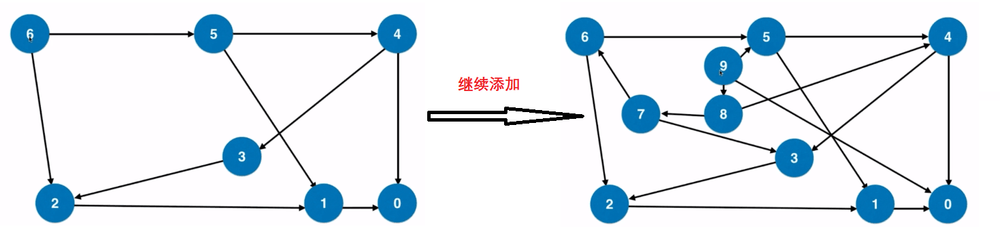

# 栈的基础使用

## 题目20

给定一个只包括` '('，')'，'{'，'}'，'['，']' `的字符串，判断字符串是否有效。

有效字符串需满足：

1. 左括号必须用相同类型的右括号闭合。
2. 左括号必须以正确的顺序闭合。

注意空字符串可被认为是有效字符串。

**示例 1:**

> 输入: "()"
> 输出: true

**示例 2:**

> 输入: "()[]{}"
> 输出: true

**示例 3:**

> 输入: "(]"
> 输出: false

**示例 4:**

> 输入: "([)]"
> 输出: false

**示例 5:**

> 输入: "{[]}"
> 输出: true

#### 答案

栈顶元素反 映了在嵌套的层次关系中, 最近的需要匹配的元素

```java
public boolean isValid(String s) {

    // 匹配规则
    HashMap<Character, Character> role = new HashMap<>();
    // key: 右括号, value: 左括号
    role.put(']', '[');
    role.put('}', '{');
    role.put(')', '(');

    // 栈, 用来存储左括号
    Stack<Character> stack = new Stack<>();

    // 进行循环
    for (int i = 0; i < s.length(); i++) {
        // 取出的字符
        Character c = s.charAt(i);
        // 如果是左括号, 入栈
        if (c == '(' || c == '[' || c == '{') {
            stack.push(c);
        }
        // 如果栈中没有元素, 则匹配失败
        else if (stack.isEmpty()) {
            return false;
        }
        // 是右括号, 进行比较, 如果取出的字符与栈顶的字符不相等
        else if (!role.get(c).equals(stack.pop())) {
            return false;
        }
    }
    return stack.isEmpty();
}
```

## 题目150

根据逆波兰表示法，求表达式的值。

有效的运算符包括 +, -, *, / 。每个运算对象可以是整数，也可以是另一个逆波兰表达式。

**说明：**

> 整数除法只保留整数部分。
> 给定逆波兰表达式总是有效的。换句话说，表达式总会得出有效数值且不存在除数为 0 的情况。

**示例 1：**

> 输入: ["2", "1", "+", "3", "*"]
> 输出: 9
> 解释: ((2 + 1) * 3) = 9

**示例 2：**

> 输入: ["4", "13", "5", "/", "+"]
> 输出: 6
> 解释: (4 + (13 / 5)) = 6

**示例 3：**

> 输入: ["10", "6", "9", "3", "+", "-11", "*", "/", "*", "17", "+", "5", "+"]
> 输出: 22
> 解释: 
>   ((10 * (6 / ((9 + 3) * -11))) + 17) + 5
> = ((10 * (6 / (12 * -11))) + 17) + 5
> = ((10 * (6 / -132)) + 17) + 5
> = ((10 * 0) + 17) + 5
> = (0 + 17) + 5
> = 17 + 5
> = 22

#### 答案

```java

```

## 题目71


# 递归与二叉树的关系

三种遍历

## 题目144

使用栈模拟系统栈, 写出非递归程序

```java
// 方法一: 递归
public List<Integer> preorderTraversal(TreeNode root) {
    List<Integer> res = new ArrayList<>();
    preOrder(root, res);
    return res;
}

public void preOrder(TreeNode node, List list) {
    if (node == null) return;
    list.add(node.val);
    preOrder(node.left, list);
    preOrder(node.right, list);
}

// 方法二: 非递归
public List<Integer> preorderTraversal2(TreeNode root) {

    List<Integer> res = new ArrayList<>();
    Stack<TreeNode> stack = new Stack<>();

    if (root == null) return res;

    stack.push(root);
    while (!stack.isEmpty()) {
        TreeNode cur = stack.pop();
        res.add(cur.val);
        if (cur.right != null)
            stack.add(cur.right);
        if (cur.left != null)
            stack.add(cur.left);
    }
    return res;
}

public class Command {
    String s;
    TreeNode node;

    public Command(String s, TreeNode node) {
        this.s = s;
        this.node = node;
    }
}

// 方法三: 模拟系统栈
public List<Integer> preorderTraversal3(TreeNode root) {

    List<Integer> res = new ArrayList<>();
    if (root == null) return res;

    Stack<Command> stack = new Stack<>();

    stack.push(new Command("go", root));
    while (!stack.isEmpty()) {
        Command cur = stack.pop();

        if (cur.s.equals("go")) {
            if (cur.node.right != null)
                stack.push(new Command("go", cur.node.right));
            if (cur.node.left != null)
                stack.push(new Command("go", cur.node.left));
            stack.push(new Command("print", cur.node));

        } else {
            res.add(cur.node.val);
        }

    }
    return res;
}
```

## 题目94

给定一个二叉树，返回它的中序 遍历。

**示例:**

> 输入: [1,null,2,3]
>    1
>     /
>      2
>     /
>    3
>
> 输出: [1,3,2]
>
> 进阶: 递归算法很简单，你可以通过迭代算法完成吗？

#### 答案

```java
// 方法一: 非递归
public List<Integer> inorderTraversal(TreeNode root) {
    List<Integer> res = new ArrayList<>();

    Stack<TreeNode> stack = new Stack<>();
    TreeNode p = root;

    while (!stack.isEmpty() || p != null) {
        // 将 p为根节点的树遍历到他的最左树
        while (p != null) {
            stack.push(p);
            p = p.left;
        }

        // 必须保证栈不为空, 才可以取出元素
        if (!stack.isEmpty()) {
            p = stack.pop();    // 取出栈顶元素
            res.add(p.val);     // 操作
            p = p.right;        // 访问右子树, 如果右子树不为空, 继续遍历以右子树为根节点的树, 如果为空, 则访问 p的父节点
        }
    }
    return res;
}
```


## 题目145


## 题目341


# 队列

队列的基本应用--- 广度优先遍历

* 树: 层序遍历
* 图: 无权图的最短路径

## 题目102

给定一个二叉树，返回其按层次遍历的节点值。 （即逐层地，从左到右访问所有节点）。

**例如:**

> 给定二叉树: [3,9,20,null,null,15,7]
>
> ​    3
>
>    / /
>   9  20
>       /  /
>     15   7
>
> 返回其层次遍历结果：
>
> [
>   [3],
>   [9,20],
>   [15,7]
> ]

#### 答案

使用队列来遍历整棵树, 关键是如何记录相应的成熟问题

```java
public List<List<Integer>> levelOrder(TreeNode root) {
    // 用于存放结果
    List<List<Integer>> res = new ArrayList<>();
    if (root == null)
        return res;

    // 用于存放结点
    LinkedList<Pair<TreeNode, Integer>> queue = new LinkedList<>();

    queue.addLast(new Pair<>(root,0));
    // 只要队列中不为空
    while (!queue.isEmpty()) {
        // 队首元素出队, 获取相应值
        Pair<TreeNode, Integer> front = queue.removeFirst();
        TreeNode node = front.getKey();
        int level = front.getValue();

        // 如果相等, 说明是新一层的元素
        if (level == res.size())
            res.add(new ArrayList<>());

        // 为本层的添加数据
        res.get(level).add(node.val);
        // 入列, 不要忘记 level + 1
        if (node.left != null) {
            queue.addLast(new Pair<> (node.left, level + 1));
        }
        if (node.right != null) {
            queue.addLast(new Pair<> (node.right, level + 1));
        }
    }
    return res;
}
```

## 题目107


## 题目103


## 题目199


# BFS和图的最短路径

基础在另一张节中有介绍

## 题目279

给定正整数 n，找到若干个完全平方数（比如 1, 4, 9, 16, ...）使得它们的和等于 n。你需要让组成和的完全平方数的个数最少。

**示例 1:**

> 输入: n = 12
> 输出: 3 
> 解释: 12 = 4 + 4 + 4.

**示例 2:**

> 输入: n = 13
> 输出: 2
> 解释: 13 = 4 + 9.

#### 答案

**对问题建模:**整个问题转化为一个图论问题。

* 从n到0，每个数字表示一个节点;
* 如果两个数字x到y相差一个完全平方数， 则连接一条边。
* 我们得到了一个无权图。
* 原问题转化成，求这个无权图中从n到0的最短路径。



###### 答案


## 题目127


## 题目126


## 队列

队列可以理解为就是队头, 队尾, 入队就是放入队中元素, 出队就是从队中拿出元素, 具体的逻辑是什么, 就形成了不同的队列.

优先队列就是寻找元素中的最大值和最小值, 来进行出列, 

优先队列的底层实现: 堆

## 题目347

给定一个非空的整数数组，返回其中出现频率前 k 高的元素。

**示例 1:**

> 输入: nums = [1,1,1,2,2,3], k = 2
> 输出: [1,2]

**示例 2:**

> 输入: nums = [1], k = 1
> 输出: [1]

**说明：**

> 你可以假设给定的 k 总是合理的，且 1 ≤ k ≤ 数组中不相同的元素的个数。
> 你的算法的时间复杂度必须优于 O(n log n) , n 是数组的大小。

#### 答案

使用优先队列

```java
public List<Integer> topKFrequent(int[] nums, int k) {
    // 将数组存入到 Map中, <数字, 频次>
    Map<Integer, Integer> map = new HashMap<>();
    for (int num : nums) {
        if (map.containsKey(num))
            map.put(num, map.get(num) + 1);
        else
            map.put(num, 1);
    }

    // 默认是最小堆
    PriorityQueue<Integer> pq = new PriorityQueue<>(new Comparator<Integer>() {
        @Override
        public int compare(Integer a, Integer b) {
            return map.get(a) - map.get(b);
        }
    });

    // 将 map中的 key根据频次依次比较,比最小的值大就可以放入
    for (Integer key : map.keySet()) {
        // 如果pq中的元素个数没有达到 k个, 继续放入 pq中
        if (pq.size() < k) {
            pq.add(key);
            // 如果新的元素的 key的出现频次大于pq中的最小频次, 进行替换
        } else if (map.get(key) > map.get(pq.peek())) {
            pq.remove();
            pq.add(key);
        }
    }
    // 将结果放入 list中
    List<Integer> res = new ArrayList<>();
    while (!pq.isEmpty()) {
        res.add(pq.remove());
    }
    return res;
}
```


## 题目23

