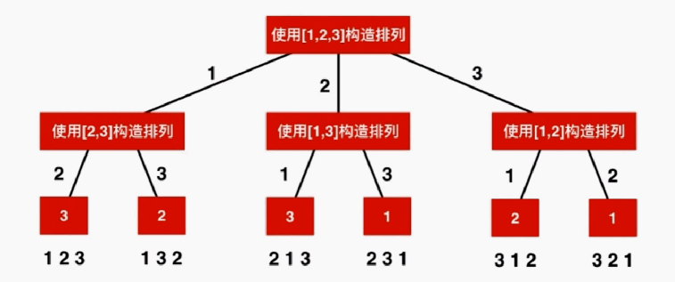

## 模版

1. 最本质的法宝是“画图”，千万不能偷懒，拿纸和笔“画图”能帮助我们更好地分析递归结构，这个“递归结构”一般是“树形结构”，而符合题意的解正是在这个“树形结构”上进行一次“深度优先遍历”，这个过程有一个形象的名字，叫“搜索”；

我们写代码也几乎是“看图写代码”，所以“画树形图”很重要。

2. 然后使用一个状态变量，一般我习惯命名为 `path`、`pre` ，在这个“树形结构”上使用“深度优先遍历”，根据题目需要在适当的时候把符合条件的“状态”的值加入结果集；

这个“状态”可能在叶子结点，也可能在中间的结点，也可能是到某一个结点所走过的路径。

3、在某一个结点有多个路径可以走的时候，使用循环结构。当程序递归到底返回到原来执行的结点时，“状态”以及与“状态”相关的变量需要“重置”成第  1  次走到这个结点的状态，这个操作有个形象的名字，叫“回溯”，“回溯”有“恢复现场”的意思：意即“回到当时的场景，已经走过了一条路，尝试走下一条路”。

第 2 点中提到的状态通常是一个列表结构，因为一层一层递归下去，需要在列表的末尾追加，而返回到上一层递归结构，需要“状态重置”，因此要把列表的末尾的元素移除，符合这个性质的列表结构就是“栈”（只在一头操作）。

4、当我们明确知道一条路走不通的时候，例如通过一些逻辑计算可以推测某一个分支不能搜索到符合题意的结果，可以在循环中 `continue` 掉，这一步操作叫“剪枝”。

“剪枝”的意义在于让程序尽量不要执行到更深的递归结构中，而又不遗漏符合题意的解。因为搜索的时间复杂度很高，“剪枝”操作得好的话，能大大提高程序的执行效率。

“剪枝”通常需要对待搜索的对象做一些预处理，例如第 47 题、第 39 题、第 40 题、第 90 题需要对数组排序。“剪枝”操作也是这一类问题很难的地方，有一定技巧性。

总结一下：“回溯” = “深度优先遍历” + “状态重置” + “剪枝”，写好“回溯”的前提是“画图”。因此，非要写一个模板，我想它可能长这个样子：

```python
# 回溯搜索的模板

def backtrack(待搜索的集合, 递归到第几层, 状态变量 1, 状态变量 2, 结果集):
    # 写递归函数都是这个套路：先写递归终止条件
    if 可能是层数够深了:
        # 打印或者把当前状态添加到结果集中
        return

    for 可以执行的分支路径 do
        
        # 剪枝
        if 递归到第几层, 状态变量 1, 状态变量 2, 符合一定的剪枝条件:
            continue

        对状态变量状态变量 1, 状态变量 2 的操作（#） 
   
        # 递归执行下一层的逻辑
        backtrack(待搜索的集合, 递归到第几层, 状态变量 1, 状态变量 2, 结果集)

        对状态变量状态变量 1, 状态变量 2 的操作（与标注了 # 的那一行对称，称为状态重置）
        
    end for
```


# 树形问题

解决问题的思路是一棵树的形状

递归调用结束后, 要返回上一层继续调用. 每一层的递归调用都是如此. 这种特征就叫回溯

回溯法是暴力解法的一个主要实现手段

## 题目17

给定一个仅包含数字 2-9 的字符串，返回所有它能表示的字母组合。

给出数字到字母的映射如下（与电话按键相同）。注意 1 不对应任何字母。


**示例:**

> 输入："23"
> 输出：["ad", "ae", "af", "bd", "be", "bf", "cd", "ce", "cf"].

**说明:**
尽管上面的答案是按字典序排列的，但是你可以任意选择答案输出的顺序。

#### 答案

转化为一颗树结构


digits是数字字符串

s(digits)是 digits所能代表的字母字符串

```
s(igitsl[...n-1])
= letter(digits[0]) + s(digits[1...n-1 ])
= letter(digits[O]) + letter(digits[1]) + s(digits[2...n-1])
=  ...

```

###### 代码

```java
public class Pro17 {
    // 数字和字母的对应关系
    Map<Character, String> phone = new HashMap<Character, String>() {{
        put('2', "abc");
        put('3', "def");
        put('4', "ghi");
        put('5', "jkl");
        put('6', "mno");
        put('7', "pqrs");
        put('8', "tuv");
        put('9', "wxyz");
    }};
    // 用于存放结果
    List<String> res = new ArrayList<String>();

    // 程序入口
    public List<String> letterCombinations(String digits) {
        findCombination(digits, 0, "");
        return res;
    }

    /**
     * 寻找和 digits[index]匹配的字母, 获得 digits[0...index]翻译得到的解
     * s中保存了此时从 digits[0...index-1]翻译得到的一个字母字符串.
     */
    private void findCombination(String digits, int index, String s) {
        // 结束条件
        if (index == digits.length()) {
            res.add(s);     // 存入结果集中
            return;
        }
        // 获取需要遍历的此时的数字所代表的字符串
        String curStr = phone.get(digits.charAt(index));

        for (int i = 0; i < curStr.length(); i++) {
            findCombination(digits, index + 1, s + curStr.charAt(i));
        }
    }
}
```


## 题目93 — 复原 IP地址

给定一个只包含数字的字符串，复原它并返回所有可能的 IP 地址格式。

**示例:**

> 输入: "25525511135"
> 输出: ["255.255.11.135", "255.255.111.35"]

### 答案

#### 方法一

暴力法

找出所有的可能, 在将不符合要求的删除掉

###### 代码

```java
public class Pro93 {
    // 暴力法
    public List<String> restoreIpAddresses(String s) {
        List<String> res = new ArrayList<>();
        int length = s.length();

        for (int i = 0; i < 3; i++)
            for (int j = i + 1; j < i + 4; j++)
                for (int k = j + 1; k < j + 4; k++)
                    if (i < length && j < length && k < length) {
                        String temp1 = s.substring(0, i + 1);       // 第一段结果
                        String temp2 = s.substring(i + 1, j + 1);   // 第二段结果
                        String temp3 = s.substring(j + 1, k + 1);   // 第三段结果
                        String temp4 = s.substring(k + 1);          // 第四段结果
                        if (helper(temp1) && helper(temp2) && helper(temp3) && helper(temp4))
                            res.add(temp1 + "." + temp2 + "." + temp3 + "." + temp4);
                    }
        return res;
    }

    // 判断字符串是否符合要求
    private boolean helper(String tmp) {
        if (tmp == null || tmp.length() == 0 || tmp.length() > 3 || (tmp.charAt(0) == '0' && tmp.length() > 1) || Integer.parseInt(tmp) > 255)
            return false;
        return true;
    }
}
```

#### 方法二

回溯法, 详情见代码

###### 代码

```java
public class Pro93 {

    List<String> res = new ArrayList<>();

    // 回溯法
    public List<String> restoreIpAddresses(String s) {
        backtracking(s, 0, new ArrayList<>());
        return res;
    }

    /**
     * @param s    递归回溯
     * @param pos 当前扫描到的s的位置
     * @param cur 当前答案，以 String List的形式，最后再 join成String形式
     *            例如 [[255],[255],[111],[35]] -> 255.255.111.35
     */
    private void backtracking(String s, int pos, List<String> cur) {
        if (cur.size() >= 4) {
            if (pos == s.length())
                res.add(String.join(".", cur));
            return;
        }

        for (int i = 1; i <= 3; i++) {
            // 进行剪枝
            if (pos + i > s.length()) break;
            String segment = s.substring(pos, pos + i);    // 这一段结果
            // 剪枝: 不能以 0开头，不能大于255, 否则跳过本次添加
            if (segment.startsWith("0") && segment.length() > 1 || (i == 3 && Integer.parseInt(segment) > 255))
                continue;
            cur.add(segment);
            // 向后递归
            backtracking(s, pos + i, cur);
            // 状态还原
            cur.remove(cur.size() - 1);
        }
    }
}
```


## 题目131


# 回溯算法的应用

排列问题

## 题目46 — 全排列

给定一个没有重复数字的序列，返回其所有可能的全排列。

**示例:**

> 输入: [1,2,3]
> 输出:
> [
>   [1,2,3],  [1,3,2],  [2,1,3],  [2,3,1],  [3,1,2],  [3,2,1]
> ]

#### 答案



**公式:** `Perms(nums[0…n-1]) = {取出一个数字} + Perms(nums[{0…n-1} - 这个数字])`

###### 代码

很经典, 需要细细揣摩

```java
public class Pro46 {
    private List<List<Integer>> res;	// 用于存放结果
    private boolean[] used;				// 记录 nums的每个位置是否被使用过

    // 程序入口
    public List<List<Integer>> permute(int[] nums) {
        res = new ArrayList<>();
        if (nums == null || nums.length == 0) 
            return res;

        used = new boolean[nums.length];
        generatePermutation(nums, 0, new LinkedList<>());
        return res;
    }

    /**
     * 向这个排列的末尾添加第 index个元素, 获得一个有 index个元素的排列
     *
     * @param nums
     * @param index     nums的下标
     * @param p         p中保存了一个有 index-1个元素的排列。
     */
    public void generatePermutation(int[] nums, int index, LinkedList<Integer> p) {
        // 递归结束条件
        if (index == nums.length) {
            res.add((List<Integer>) p.clone());
            return;
        }

        for (int i = 0; i < nums.length; i++) {
            // 如果这个元素还没有被使用过， 注意顺序
            if (!used[i]) {
                used[i] = true;     // 标记上已经使用
                p.add(nums[i]);
                generatePermutation(nums, index + 1, p);
                // 状态进行回溯
                p.removeLast();     // 删除本轮添加的元素
                used[i] = false;    // 清空标记
            }
        }
    }
}
```


## 题目47 — 全排列 II

给定一个可包含重复数字的序列，返回所有不重复的全排列。

**示例:**

> 输入: [1,1,2]
> 输出:
> [
>   [1,1,2],  [1,2,1],  [2,1,1]
> ]

#### 答案

参考力扣题解

    当数组中，有了重复元素的时候，其实也不难，我们可以先把数组排个序，这样在递归的过程中就可以很容易发现重复的元素。当发现重复元素的时候，让这一个分支跳过，就达到了“剪枝”的效果，重复的排列就不会出现在结果集中。

请看下图，我们把排序以后的数组，就当做它没有重复元素的话，还按照之前的回溯方法，也很容易看出重复的分支，把它剪去即可。

**步骤一**


**步骤二**


**步骤三** 


**步骤四**


基于第 46 题，做 2 处修改即可：

1. 在开始回溯算法之前，对数组进行排序操作, 排序后才能进行剪枝操作

2. 在进入一个新的分支之前，看一看这个数是不是和之前的数一样，如果这个数和之前的数一样(i > 0，保证 i-1 >= 0)，符合结果的有两种情况.
   1. 横列数字相同,即我们要剪枝的情况
   2. 一个路径下来使用到两次1，不应该进行剪枝
3. 为了区分，所以继续加条件
   1. 如果是对于一条分支的相同结点来看(不该剪)，遍历的条件是之前的结点被使用过，因为要跳过这次遍历，加条件之前的数还未使用过，将其排除（代码中采用这种）
   2. 如果是对于同一阶层的相同结点来看(该剪)，因为要跳过这次遍历，要保证之前的结点使用过
   3. 两种判断都可以通过，但是要弄清楚含义很重要


###### 代码

```java
public class Pro47 {
    private List<List<Integer>> res;
    private boolean[] used;

    public List<List<Integer>> permuteUnique(int[] nums) {
        res = new ArrayList<>();
        if (nums == null || nums.length == 0) return res;

        // 修改一: 首先排序，之后才有可能发现重复分支
        Arrays.sort(nums);
        used = new boolean[nums.length];
        generatePermutation(nums, 0, new LinkedList<>());
        return res;
    }

    public void generatePermutation(int[] nums, int index, LinkedList<Integer> p) {
        if (index == nums.length) {
            res.add((List<Integer>) p.clone());
            return;
        }

        for (int i = 0; i < nums.length; i++) {
            if (!used[i]) {
                // 修改二,进行剪枝, 剪枝条件
                if (i > 0 && nums[i] == nums[i - 1] && !used[i - 1])
                    // 这种情况跳过即可
                    continue;

                used[i] = true;		// 将状态设置为已访问过
                p.add(nums[i]);
                generatePermutation(nums, index + 1, p);
                p.removeLast();		// 删除本轮添加的元素
                used[i] = false;	// 本轮状态还原
            }
        }
    }
}
```


# 组合问题

## 题目77 — 组合

 给定两个整数 n 和 k，返回 1 ... n 中所有可能的 k 个数的组合。

**示例:**

> 输入: n = 4, k = 2
> 输出:
> [ [2,4], [3,4],  [2,3],  [1,2],  [1,3],  [1,4] ]

### 答案

题目当中 [1, 2], [2, 1]为一种答案, 所以为了避免重复, 向后继续查找

###### 思路


###### 代码

```java
public class Pro77 {
    private List<List<Integer>> res;
    private int count;  	// 选取的元素个数

    // 访问入口
    public List<List<Integer>> combine(int n, int k) {
        res = new ArrayList<>();
        if (n <= 0 || k <= 0 || k > n) return res;

        count = k;
        findCombinations(n, 1, new LinkedList<>());
        return res;
    }

    private void findCombinations(int n, int start, LinkedList<Integer> p) {
        if (p.size() == count) {
            res.add((List<Integer>) p.clone());
            return;
        }
        // 进行优化, 还有 k - p.size()个空位, 所以 [i...n]中至少要有 k-p.size() 个元素
        // n - i >= k - p.size()
        // i最多为 n - (k-p.size()) + 1, 比他大, 后面没有那么多的空位了
        for (int i = start; i <= n - (count - p.size()) + 1; i++) {
            p.addLast(i);
            findCombinations(n, i + 1, p);
            p.removeLast();		// 清除当前状态
        }
    }
}
```


## 题目39 — 组合总数

给定一个无重复元素的数组 candidates 和一个目标数 target ，找出 candidates 中所有可以使数字和为 target 的组合。

candidates 中的数字可以无限制重复被选取。

**说明：**

* 所有数字（包括 target）都是正整数。
* 解集不能包含重复的组合。 

**示例 1:**

> 输入: candidates = [2,3,6,7], target = 7,
> 所求解集为:
> [
>   	[7],  [2,2,3]
> ]

**示例 2:**

> 输入: candidates = [2,3,5], target = 8,
> 所求解集为:
> [
>   	[2,2,2,2],  [2,3,3],  [3,5]
> ]

### 答案

**思路：**以 target = 7 为根结点，每一个分支做减法。减到 000 或者负数的时候，剪枝。其中，减到 000 的时候结算，这里“结算”的意思是添加到结果集。

题目中的图没有画完, 没有画的情况也是不符合题意的情况


**总结一下：**在减的过程中，得到 000 或者负数，就没有必要再走下去，所以这两种情况就分别表示成为叶子结点。此时递归结束，然后要发生回溯。

画出图以后，我看了一下，我这张图画出的结果有 444 个 000，对应的路径是 [[2, 2, 3], [2, 3, 2], [3, 2, 2], [7]] ，而示例中的解集只有 [[7], [2, 2, 3]]，很显然，我的分析出现了问题。问题是很显然的，**我的结果集出现了重复。重复的原因是**

    后面分支的更深层的边出现了前面分支低层的边的值。


#### 去重实现一

就是根据题目要求实现去重效果, 不具有通用性, 去重实现二具有通用性

###### 代码一

非排序去重, 只有遇到剪到负数的时候剪枝

```java
// 非排序去重, 只有遇到剪到负数的时候剪枝
public class Pro39 {

    private List<List<Integer>> res;
    private int[] candidates;

    // 程序入口
    public List<List<Integer>> combinationSum(int[] candidates, int target) {
        res = new ArrayList<>();
        this.candidates = candidates;
        findCombinationSum(target, new LinkedList<>());
        return res;
    }

    /**
     * @param residue 还需要的剩余值
     * @param p       存放目前的结果
     */
    private void findCombinationSum(int residue, LinkedList<Integer> p) {

        if (residue == 0) {     // 剩余
            // Java 中可变对象是引用传递，因此需要将当前 path 里的值拷贝出来
            res.add((List<Integer>) p.clone());
            return;
        }
        if (residue < 0) {
            return;
        }

        for (int i = 0; i < candidates.length; i++) {
            int temp = candidates[i];
            // 去重, 后面选取的数 >= 前面的选取的数
            if (p.size() == 0 || temp >= p.getLast()) {
                p.addLast(temp);
                findCombinationSum(residue - temp, p);
                p.removeLast();     // 清空本轮状态
            }
        }
    }
}
```

###### 代码二

排序去重, 进行优化, 剪枝更加彻底

```java
class Pro39 {

    private List<List<Integer>> res;
    private int[] candidates;

    // 程序入口
    public List<List<Integer>> combinationSum(int[] candidates, int target) {
        // 优化一: 对数组进行排序
        Arrays.sort(candidates);
        res = new ArrayList<>();
        this.candidates = candidates;
        findCombinationSum(target, new LinkedList<>());
        return res;
    }

    private void findCombinationSum(int residue, LinkedList<Integer> p) {
        if (residue == 0) {
            res.add((List<Integer>) p.clone());
            return;
        }

        // 优化添加的代码 2: 在循环的时候做判断，尽量避免系统栈的深度
        // residue - candidates[i] 表示下一轮的剩余, 如果下一轮的剩余都小于 0, 就没有必要进行后面的循环了
        // 这一点基于原始数组是排序数组的前提，因为如果计算后面的剩余，只会越来越小
        for (int i = 0; i < candidates.length && residue - candidates[i] >= 0; i++) {
            int temp = candidates[i];
            if (p.size() == 0 || temp >= p.getLast()) {
                p.addLast(temp);
                findCombinationSum(residue - temp, p);
                p.removeLast();    
            }
        }
    }
}
```


#### 去重实现二

按照顺序读取候选元素去重

###### 代码三

```java
class Pro3 {

    private List<List<Integer>> res;
    private int[] candidates;

    // 程序入口
    public List<List<Integer>> combinationSum(int[] candidates, int target) {

        res = new ArrayList<>();
        this.candidates = candidates;
        findCombinationSum(target, 0, new LinkedList<>());
        return res;
    }

    /**
     * @param residue
     * @param start   从 start索引的后面开始继续寻找, 因为是去重, 避免出现
     *                [1,7], [7,1]这样的重复答案, 所以不再对之前找过的在进行查找
     *                按照顺序读取候选元素去重
     * @param p
     */
    private void findCombinationSum(int residue, int start, LinkedList<Integer> p) {

        if (residue == 0) {
            res.add((List<Integer>) p.clone());
            return;
        }

        if (residue < 0) {
            return;
        }
		// i = start去重, 保证不会遍历到之前的元素
        for (int i = start; i < candidates.length; i++) {
            p.addLast(candidates[i]);
            findCombinationSum(residue - candidates[i], i, p);
            p.removeLast();     // 清空本轮状态

        }
    }
}
```


###### 代码四

```java
class Pro39_3 {

    private List<List<Integer>> res;
    private int[] candidates;

    // 程序入口
    public List<List<Integer>> combinationSum(int[] candidates, int target) {
        // 优化一: 对数组进行排序
        Arrays.sort(candidates);
        res = new ArrayList<>();
        this.candidates = candidates;
        findCombinationSum(target, 0, new LinkedList<>());
        return res;
    }


    private void findCombinationSum(int residue, int start, LinkedList<Integer> p) {

        if (residue == 0) {
            res.add((List<Integer>) p.clone());
            return;
        }

        for (int i = start; i < candidates.length && residue - candidates[i] >= 0; i++) {

            p.addLast(candidates[i]);
            findCombinationSum(residue - candidates[i], i, p);
            p.removeLast();     // 清空本轮状态

        }
    }
}
```


## 题目40 — 组合总数 II

给定一个数组 candidates 和一个目标数 target ，找出 candidates 中所有可以使数字和为 target 的组合。

candidates 中的每个数字在每个组合中只能使用一次。

**说明：**

    所有数字（包括目标数）都是正整数。
    解集不能包含重复的组合。 

**示例 1:**

> 输入: candidates = [10,1,2,7,6,1,5], target = 8,
> 所求解集为:
> [
>   [1, 7],
>   [1, 2, 5],
>   [2, 6],
>   [1, 1, 6]
> ]

**示例 2:**

> 输入: candidates = [2,5,2,1,2], target = 5,
> 所求解集为:
> [
> 	[1,2,2], [5]
> ]

### 答案

#### 画图

图一: 画出所有的情况


图二: 进行剪枝


###### 代码

```java
public class Pro40 {

    private static List<List<Integer>> res;     // 存放结果集
    private int[] candidates;                   // 传进来的数组

    // 程序入口
    public List<List<Integer>> combinationSum2(int[] candidates, int target) {

        // 先将数组排序
        Arrays.sort(candidates);
        // 初始化
        res = new ArrayList<>();
        this.candidates = candidates;
        // 核心操作
        findCombinationSum(target, 0, new LinkedList<>());
        return res;
    }

    private void findCombinationSum(int residue, int start, LinkedList<Integer> p) {
        if (residue == 0) {
            res.add((List<Integer>) p.clone());
            return;
        }

        for (int i = start; i < candidates.length && residue - candidates[i] >= 0; i++) {
            // 剪枝操作: 避免重复的结果集, 这一步剪枝操作基于 candidates 数组是排序数组的前提下
            if (i > start && candidates[i] == candidates[i - 1])
                continue;

            p.addLast(candidates[i]);
            // 【关键】因为元素不可以重复使用，这里递归传递下去的是 i + 1 而不是 i
            findCombinationSum(residue - candidates[i], i + 1, p);
            p.removeLast();     // 清空本轮状态
        }
    }
}
```


## 题目216


## 题目78 — 子集

给定一组不含重复元素的整数数组 nums，返回该数组所有可能的子集（幂集）。

**说明：**解集不能包含重复的子集。

**示例:**

> 输入: nums = [1,2,3]
> 输出:
> [
>   [3], [1], [2],
>   [1,2,3],
>   [1,3], [2,3], [1,2],
>   []
> ]

### 答案

#### 思路一:

这道题告诉我们整数数组 nums 不包含重复元素。因此作图，画出递归树结构是关键。

1. 因为是组合问题，所以我们按顺序读字符，就不需要设置 used 数组；
2. 经过分析，我们知道，在根结点、非叶子结点和叶子结点都需要结算

###### 图示


###### 代码

```java
public class Pro78 {

    private List<List<Integer>> res;
    private int[] nums;

    // 程序入口
    public List<List<Integer>> subsets(int[] nums) {

        // 初始化
        res = new ArrayList<>();
        if (nums.length == 0) return res;
        this.nums = nums;

        find(0, new LinkedList<>());
        return res;
    }

    private void find(int start, LinkedList<Integer> pre) {
        // 没有显式的递归终止

        // 每次的结果都要添加进来, 注意：Java 的引用传递机制，这里要 new 一下
        res.add(new ArrayList<>(pre));

        // i = start 进行了剪枝
        for (int i = start; i < nums.length; i++) {
            pre.add(nums[i]);
            find(i + 1, pre);
            pre.removeLast();   // 状态清空
        }
    }
}
```

#### 思路二

还没有看

使用位掩码

数组的每个元素，可以有两个状态：

1、不在子数组中（用 000 表示）；
2、在子数组中（用 111 表示）。

从 0 到 2 的数组个数次幂（不包括）的整数的二进制表示就能表示所有状态的组合。


###### 代码

```java
public class Solution5 {

    public List<List<Integer>> subsets(int[] nums) {
        int size = nums.length;
        int n = 1 << size;
        List<List<Integer>> res = new ArrayList<>();

        for (int i = 0; i < n; i++) {
            List<Integer> cur = new ArrayList<>();
            for (int j = 0; j < size; j++) {
                if (((i >> j) & 1) == 1) {
                    cur.add(nums[j]);
                }
            }
            res.add(cur);
        }
        return res;
    }

    public static void main(String[] args) {
        int[] nums = {1, 2, 3};
        Solution5 solution5 = new Solution5();
        List<List<Integer>> subsets = solution5.subsets(nums);
        System.out.println(subsets);
    }
}
```


## 题目90


## 题目401


# 二维平面上使用回溯法

## 题目79

给定一个二维网格和一个单词，找出该单词是否存在于网格中。

单词必须按照字母顺序，通过相邻的单元格内的字母构成，其中“相邻”单元格是那些水平相邻或垂直相邻的单元格。同一个单元格内的字母不允许被重复使用。

**示例:**

> board =
> [
> 	['A','B','C','E'],  
>
> ​	['S','F','C','S'],  
>
> ​	['A','D','E','E']
> ]
>
> 给定 word = "ABCCED", 返回 true.
> 给定 word = "SEE", 返回 true.
> 给定 word = "ABCB", 返回 false.

#### 答案

###### 代码一

```java
public class Pro79 {
    private int row;    // 二维数组的行数和列数
    private int col;
    private String word;    // 字符串
    private char[][] board; // 二维数组


    //        x-1,y
    // x,y-1  x,y    x,y+1
    //        x+1,y
    private int[][] direction = {{-1, 0}, {0, 1}, {1, 0}, {0, -1}};     // 移动方向分别是 上, 下, 左, 右
    private boolean[][] visited;    // 标记已经走过的位置

    // 检查坐标是否在 二维数组中
    private boolean inArea(int newx, int newy) {
        return newx >= 0 && newx < row && newy >= 0 && newy < col;
    }

    // x, y: 二维数组中的坐标, index: 字符串中的下标
    private boolean searchWord(int index, int startx, int starty) {
        // 递归结束条件, 找到最后一个字符, 并且相等
        if (index == word.length() - 1)
            return word.charAt(index) == board[startx][starty];

        // 如果 数组中的字符 = word对应的字符
        if (word.charAt(index) == board[startx][starty]) {
            // 不要忘记对走过的位置进行设置
            visited[startx][starty] = true;
            // 进行上下左右 四次递归
            for (int i = 0; i < 4; i++) {
                // 注意不要写错
                int newx = startx + direction[i][0];
                int newy = starty + direction[i][1];

                // 保证新坐标在数组区域内, 并且是没有走过的位置
                if (inArea(newx, newy) && !visited[newx][newy])
                    // 如果继续循环到底, 并且成功找到, 返回 true
                    if (searchWord(index + 1, newx, newy))
                        return true;
            }
            // 千万不要忘记进行走过的地方要回溯
            visited[startx][starty] = false;
        }
        return false;
    }

    // 程序入口
    public boolean exist(char[][] board, String word) {
		// 进行初始化工作
        row = board.length;
        col = board[0].length;
        if (row <= 0 || col <= 0)
            throw new IllegalArgumentException("board is error");

        visited = new boolean[row][col];    // 默认值为 false, 好像没用
        this.board = board;
        this.word = word;

        // 对于二维数组中每一个位置进行遍历
        for (int i = 0; i < row; i++)
            for (int j = 0; j < col; j++)
                // 从 board[i, j]为起始位置进行寻找
                if (searchWord(0, i, j))
                    return true;
        return false;
    }
}
```

###### 代码二

思路相同, 代码实现上略有不同

```java
public class Pro79 {
    private int row;    // 二维数组的行数和列数
    private int col;
    private String word;    // 字符串
    private char[][] board; // 二维数组

    private boolean[][] visited;    // 标记已经走过的位置

    // 判断 board[newx, newy]是否在范围内
    private boolean inArea(int newx, int newy) {
        return newx >= 0 && newx < row && newy >= 0 && newy < col;
    }

    // x, y: 二维数组中的坐标, index: 字符串中的下标
    private boolean searchWord(int index, int startx, int starty) {
        // 递归结束条件
        // 不满足的条件
        if (!inArea(startx, starty) || word.charAt(index) != board[startx][starty] || visited[startx][starty])
            return false;
        // 满足的条件
        if (index == word.length() - 1)
            return true;

        visited[startx][starty] = true;
        // 四个方向只要有一个方向有满足条件的就为 true
        boolean flag =
                searchWord(index + 1, startx - 1, starty) ||
                        searchWord(index + 1, startx, starty + 1) ||
                        searchWord(index + 1, startx + 1, starty) ||
                        searchWord(index + 1, startx, starty - 1);
        // 状态还原
        visited[startx][starty] = false;
        return flag;
    }
	
    // 程序入口
    public boolean exist(char[][] board, String word) {

        row = board.length;
        col = board[0].length;
        if (row <= 0 || col <= 0)
            throw new IllegalArgumentException("board is error");

        // 进行初始化工作
        visited = new boolean[row][col];    // 默认值为 false, 好像没用
        this.board = board;
        this.word = word;
        
        for (int i = 0; i < row; i++)
            for (int j = 0; j < col; j++)
                // 从 board[i, j]为起始位置进行寻找
                if (searchWord(0, i, j))
                    return true;
        return false;
    }
}
```


# floodfill算法

## 题目200

给定一个由 '1'（陆地）和 '0'（水）组成的的二维网格，计算岛屿的数量。一个岛被水包围，并且它是通过水平方向或垂直方向上相邻的陆地连接而成的。你可以假设网格的四个边均被水包围。

**示例 1:**

> 输入:
>
> 1   1   1   1   0
> 1   1   0   1   0
> 1   1   0   0   0
> 0   0   0   0   0
>
> 输出: 1

**示例 2:**

> 输入:
> 1   1   0   0   0
> 1   1   0   0   0
> 0   0   1   0   0
> 0   0   0   1   1
>
> 输出: 3

#### 答案

dfs, 深度优先遍历, 详情见代码

###### 代码一

```java
public class Pro200 {

    private int row;    // 二维数组的行数和列数
    private int col;
    private boolean[][] visited;    // 标记已经走过的位置
	// 移动方向分别是 上, 下, 左, 右
    private int[][] direction = {{-1, 0}, {0, 1}, {1, 0}, {0, -1}};     

	// 判断 board[newx, newy]是否在范围内
    private boolean inArea(int newx, int newy) {
        return newx >= 0 && newx < row && newy >= 0 && newy < col;
    }

    // 从 findLands[startx][starty]开始, 将四周相邻的陆地连接到一起
    private void findLands(char[][] grid, int startx, int starty) {
        // 进行标记, 已经走过
        visited[startx][starty] = true;
        for (int i = 0; i < 4; i++) {
            // 一共四轮, 每轮都代表向一个方向移动
            int newx = startx + direction[i][0];
            int newy = starty + direction[i][1];
			
            if (inArea(newx, newy) && !visited[newx][newy] && grid[newx][newy] == '1')
                findLands(grid, newx, newy);
        }
        return;
    }

    // 程序入口
    public int numIslands(char[][] grid) {
        if (grid.length <= 0 || grid[0].length <= 0)
            return 0;

        row = grid.length;
        col = grid[0].length;
        visited = new boolean[row][col];

        int res = 0;
        for (int i = 0; i < row; i++)
            for (int j = 0; j < col; j++)
                // 如果 grid[i][j] 没有被标记并且是陆地
                if (!visited[i][j] && grid[i][j] == '1') {
                    findLands(grid, i, j);
                    res++;
                }
        return res;
    }
}
```

###### 代码二

```java
class Solution {
    public int numIslands(char[][] grid) {
        int m = grid.length;
        if (grid == null || m <= 0) return 0;
        int n = grid[0].length;
        int res = 0;

        //遍历整个图
        for (int i = 0; i < m; i++)
            for (int j = 0; j < n; j++)
                if (grid[i][j] == '1') {
                    res++;
                    dfs(grid, i, j);
                }
        return res;
    }


    //遍历 以 grid[i][j]为起点 的相关网络
    private void dfs(char[][] grid, int i, int j) {
        if (i < 0 || i > grid.length - 1 || j < 0 || j > grid[0].length - 1 || grid[i][j] == '0')
            return;

        grid[i][j] = '0';
        dfs(grid, i - 1, j);
        dfs(grid, i, j + 1);
        dfs(grid, i + 1, j);
        dfs(grid, i, j - 1);
    }
}
```


## 题目130


## 题目417

 

## 题目51 — N皇后

n 皇后问题研究的是如何将 n 个皇后放置在 n×n 的棋盘上，并且使皇后彼此之间不能相互攻击。


上图为 8 皇后问题的一种解法。

给定一个整数 n，返回所有不同的 n 皇后问题的解决方案。

每一种解法包含一个明确的 n 皇后问题的棋子放置方案，该方案中 'Q' 和 '.' 分别代表了皇后和空位。

**示例:**

> 输入: 4
> 输出: [
>  [".Q..",  // 解法 1
>   "...Q",
>   "Q...",
>   "..Q."],
>
>  ["..Q.",  // 解法 2
>   "Q...",
>   "...Q",
>   ".Q.."]
> ]
> 解释: 4 皇后问题存在两个不同的解法。

### 答案

回溯法

在建立算法之前，我们来考虑两个有用的细节。

1. 一行只可能有一个皇后且一列也只可能有一个皇后。

   > 这意味着没有必要再棋盘上考虑所有的方格。只需要按列循环即可。

2. 对于所有的主对角线有 行号 + 列号 = 常数，对于所有的次对角线有 行号 - 列号 = 常数.

   > 这可以让我们标记已经在攻击范围下的对角线并且检查一个方格 (行号, 列号) 是否处在攻击位置。

如图


###### 代码

```java
public class Pro51 {

    private boolean[] col;  // 解决同一列不冲突
    private boolean[] dia1; // 解决 / 不冲突
    private boolean[] dia2; // 解决 / 不冲突

    private ArrayList<List<String>> res;
	
    // 程序入口
    public List<List<String>> solveNQueens(int n) {
        res = new ArrayList<>();
        col = new boolean[n];
        dia1 = new boolean[2 * n - 1];  // 斜边共有多少个, 找规律得出
        dia2 = new boolean[2 * n - 1];

        putQueen(n, 0, new LinkedList<>());
        return res;
    }

    // 尝试在一个 n皇后问题中, 摆放第 index行的皇后位置
    private void putQueen(int n, int index, LinkedList<Integer> row) {
        // 放到最后一个位置
        if (index == n) {
            res.add(generateBoard(n, row));
            return;
        }

        for (int i = 0; i < n; i++) {
            // 尝试将第 index行皇后放在第 i列, 同一列, 两个斜边不能出现棋子
            if (!col[i] && !dia1[index + i] && !dia2[index - i + n - 1]) {
                row.addLast(i);
                // 进行标记
                col[i] = true;		// 本列已经放过棋子
                dia1[index + i] = true;		// 本左斜行已经放过棋子
                dia2[index - i + n - 1] = true;
                putQueen(n, index + 1, row);
                // 回溯清除标记
                col[i] = false;
                dia1[index + i] = false;
                dia2[index - i + n - 1] = false;
                row.removeLast();
            }
        }
        return;

    }

    // 将 list 转换为二维数组形式的结果
    private List<String> generateBoard(int n, LinkedList<Integer> row) {
        ArrayList<String> board = new ArrayList<>();
        for (int i = 0; i < n; i++) {
            char[] charArray = new char[n];
            Arrays.fill(charArray, '.');
            charArray[row.get(i)] = 'Q';
            board.add(new String(charArray));
        }
        return board;
    }
}
```


## 题目52 — N皇后 II

n 皇后问题研究的是如何将 n 个皇后放置在 n×n 的棋盘上，并且使皇后彼此之间不能相互攻击。

上图为 8 皇后问题的一种解法。

给定一个整数 n，返回 n 皇后不同的解决方案的数量。

**示例:**

> 输入: 4
> 输出: 2
> 解释: 4 皇后问题存在如下两个不同的解法。
> [
>  [".Q..",  // 解法 1
>   "...Q",
>   "Q...",
>   "..Q."],
>
>  ["..Q.",  // 解法 2
>   "Q...",
>   "...Q",
>   ".Q.."]
> ]

### 答案

和上一题目一样, 更加简单

###### 代码

```java
public class Pro52 {

    private boolean[] col;  // 解决同一列不冲突
    private boolean[] dia1; // 解决 / 不冲突
    private boolean[] dia2; // 解决 / 不冲突

    private int res;

    // 尝试在一个 n皇后问题中, 摆放第 index行的皇后位置
    private void putQueen(int n, int index, LinkedList<Integer> row) {
        if (index == n) {
            res++;
            return;
        }

        for (int i = 0; i < n; i++) {
            // 尝试将第 index行皇后放在第 i列, 同一列, 两个斜边不能相同
            if (!col[i] && !dia1[index + i] && !dia2[index - i + n - 1]) {
                row.addLast(i);
                // 进行标记
                col[i] = true;
                dia1[index + i] = true;
                dia2[index - i + n - 1] = true;
                putQueen(n, index + 1, row);
                // 回溯清除标记
                col[i] = false;
                dia1[index + i] = false;
                dia2[index - i + n - 1] = false;
                row.removeLast();
            }
        }
    }

    public int totalNQueens(int n) {
        col = new boolean[n];
        dia1 = new boolean[2 * n - 1];  // 斜边共有多少个
        dia2 = new boolean[2 * n - 1];

        putQueen(n, 0, new LinkedList<>());
        return res;
    }
}
```


## 题目37


#### 同类题目

[39.组合总和](https://leetcode-cn.com/problems/combination-sum/)

[40. 组合总和 II](https://leetcode-cn.com/problems/combination-sum-ii/)

[46. 全排列](https://leetcode-cn.com/problems/permutations/)

[47. 全排列 II](https://leetcode-cn.com/problems/permutations-ii/)

[78. 子集](https://leetcode-cn.com/problems/subsets/)

[90. 子集 II](https://leetcode-cn.com/problems/subsets-ii/)


## 总结: 39, 40, 46, 47

再来看一遍题目要求

### 题目46 — 全排列

给定一个没有重复数字的序列，返回其所有可能的全排列。解集包含重复的组合。 

### 题目47 — 全排列 II

给定一个可包含重复数字的序列，返回所有不重复的全排列。解集包含重复的组合。 

### 题目39 — 全排列

给定一个无重复元素的数组 candidates 和一个目标数 target ，找出 candidates 中所有可以使数字和为 target 的组合。candidates 中的数字可以无限制重复被选取。解集不能包含重复的组合。 

### 题目40 — 全排列 II

给定一个数组 candidates 和一个目标数 target ，找出 candidates 中所有可以使数字和为 target 的组合。

candidates 中的每个数字在每个组合中只能使用一次。解集不能包含重复的组合。 

#### 题目特点对比

| 题目    | 数组是否有重复元素 | 元素是否无限使用 | 解集包含是否重复的组合 | 是否需要剪枝 |
| ------- | ------------------ | ---------------- | ---------------------- | ------------ |
| 题目 46 | 无                 | 否, 一次         | 包含                   | 否           |
| 题目 47 | 有                 | 否, 一次         | 包含                   | 是           |
| 题目 39 | 无                 | 是               | 不包含                 | 是           |
| 题目 40 | 有                 | 否, 一次         | 不包含                 | 是           |

### 解题关键

#### 解题流程

1. **画图:** 画出递归结构, 一般是树形结构, 找一个简单的例子画出所有的可能, 

   > 画图关键就在于: 数组是否有重复元素, 元素是否可以无限使用

2. 然后使用一个状态变量, 就来记录本轮的状态，在这个“树形结构”上使用“深度优先遍历”，根据题目需要在适当的时候把符合条件的“状态”的值加入结果集；

   > 状态变量一般习惯命名为 `path`、`pre`
   >
   > 符合条件的“状态”可能在叶子结点，也可能在中间的结点，也可能是到某一个结点所走过的路径。

3. 在某一个结点有多个路径可以走的时候，使用循环结构。不要忘记回溯. 

   > **回溯:** 当程序递归到底返回到原来执行的结点时，“状态”以及与“状态”相关的变量需要“重置”成第  1  次走到这个结点的状态
   >
   > “回溯”有“恢复现场”的意思：意即“回到当时的场景，已经走过了一条路，尝试走下一条路”。
   >
   > 第 2 点中提到的状态变量通常是一个列表结构，因为一层一层递归下去，需要在列表的末尾追加，而返回到上一层递归结构，需要“状态重置”，因此要把列表的末尾的元素移除，符合这个性质的列表结构就是“栈”（只在一头操作）。

4. 当我们明确知道一条路走不通的时候, 可以在循环中 `continue` 掉, 这一步操作叫“剪枝”。

   > 走不通的情况为该分支不能搜索到符合题意的结果, 有以下情况
   >
   > 1.  **此时结果在之前出现过:**  如第 40 题, 第 47 题
   > 2. **再向下走没有一定不会有符合题意的结果:** 如第 39题

#### 解题技巧

**辅助数组:** 判断每个元素已经被使用过

**剪枝操作:**

1. 按顺序读取候选元素，例如第 77 题：“组合”(已经排好序了)；
2. 对数组预排序，例如第 47 题, 第 40 题


