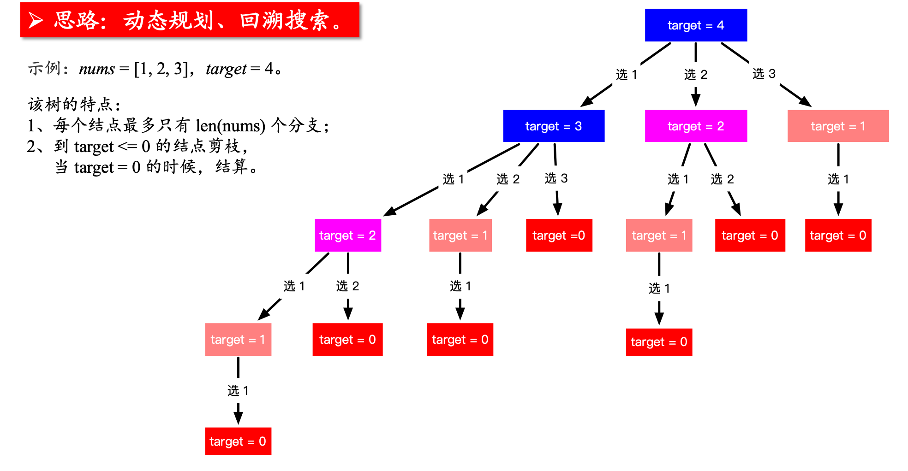

## 什么是动态规划

斐波那契数列 Fibonacci Sequence

F(0) = 1, F(1) = 1, F(n) = F(n -1)  F(n-2) 

将若干个子问题拆解成若干个子问题, 同时在求解这些子问题的过程中，我们要保存子问题的答案，使得每一个子问题只求解一次，最终获得原问题的答案


> 找到递归结构, 找到重叠子问题和最优子结构, 转化为动态规划问题

**最优子结构:** 通过求子问题的最优解, 可以获得原问题的最优解

## 题目70 — 爬楼梯

假设你正在爬楼梯。需要 n 阶你才能到达楼顶。

每次你可以爬 1 或 2 个台阶。你有多少种不同的方法可以爬到楼顶呢？

注意：给定 n 是一个正整数。

**示例 1：**

> 输入： 2
> 输出： 2
> 解释： 有两种方法可以爬到楼顶。
>
> 1. 1 阶 + 1 阶
> 2. 2 阶

**示例 2：**

> 输入： 3
> 输出： 3
> 解释： 有三种方法可以爬到楼顶。
>
> 1. 1 阶 + 1 阶 + 1 阶
> 2. 1 阶 + 2 阶
> 3. 2 阶 + 1 阶

#### 答案

###### 思路


###### 代码

```java
// 递归解决, 自上而下
public class Pro70 {
    private int[] memo;

    private int calWays(int n) {
        if (n == 1) return 1;
        if (n == 2) return 2;
        // 记忆化搜索
        if (memo[n] == -1)
            memo[n] = calWays(n - 1) + calWays(n - 2);
        return memo[n];
    }

    public int climbStairs(int n) {
        memo = new int[n + 1];
        Arrays.fill(memo, -1);
        return calWays(n);
    }
}

// 动态规划, 自下而上
public class Pro70 {
    public int climbStairs(int n) {
        // memo代表爬多少台阶数需要的步数, 1阶时为memo[1], n阶时为memo[n], 所以为 n+1
        int[] memo = new int[n + 1];
        Arrays.fill(memo, -1);

        memo[0] = 1;
        memo[1] = 1;
        // 循环代表继续向上爬
        for (int i = 2; i <= n; i++)
            memo[i] = memo[i - 1] + memo[i - 2];
        return memo[n];
    }
}
```


## 题目120 — 三角形最小路径和

给定一个三角形，找出自顶向下的最小路径和。每一步只能移动到下一行中相邻的结点上。

例如，给定三角形：

> [
>      [2],
>     [3,4],
>    [6,5,7],
>   [4,1,8,3]
> ]

自顶向下的最小路径和为 11（即，2 + 3 + 5 + 1 = 11）。

**说明：** 如果你可以只使用 O(n) 的额外空间（n 为三角形的总行数）来解决这个问题，那么你的算法会很加分。

#### 答案

###### 思路: 

动态规划, 见代码

###### 代码

隐藏条件, 层数和最后一排的数量是相同的, 但是为了方便阅读, 分开来写. 

```java
// 答案一: 使用 O(n^2)的额外空间
public int minimumTotal(List<List<Integer>> triangle) {
    int m = triangle.size();        // 层数
    int n = triangle.get(m - 1).size(); // 最后一层的数量
    int dp[][] = new int[m][n];
    // 给最后一层赋值
    for (int i = 0; i < n; i++) {
        dp[m - 1][i] = triangle.get(m - 1).get(i);
    }
    // 倒数第二层开始遍历
    for (int i = m - 2; i >= 0; i--) {
        for (int j = 0; j < triangle.get(i).size(); j++) {
            // 每一层都放子树中最小的值 + 本身
            dp[i][j] = Math.min(dp[i + 1][j], dp[i + 1][j + 1]) + triangle.get(i).get(j);
        }
    }
    return dp[0][0];
}

// 答案二: 使用 O(n)的额外空间
public int minimumTotal(List<List<Integer>> triangle) {
    // 层数也是最后一层的数量
    int size = triangle.get(triangle.size() - 1).size();
    // 每次都在自身上进行更新
    int[] memo = new int[size];

    for (int i = 0; i < size; i++)
        memo[i] = triangle.get(triangle.size() - 1).get(i);

    for (int i = size - 2; i >= 0; i--)
        for (int j = 0; j < i + 1; j++)
            // 注意是 memo[j], 不要弄混 i,j变量的含义
            memo[j] = Math.min(memo[j], memo[j + 1]) + triangle.get(i).get(j);

    return memo[0];
}
```


## 题目64 — 最小路径和

给定一个包含非负整数的 m x n 网格，请找出一条从左上角到右下角的路径，使得路径上的数字总和为最小。

**说明：**每次只能向下或者向右移动一步。

**示例:**

```
输入:
[
[1,3,1],
[1,5,1],
[4,2,1]
]
输出: 7
解释: 因为路径 1→3→1→1→1 的总和最小。
```

#### 答案

两种解法思路相同, 两种实现, 第二种更加简洁

```java
// 解法一: 使用额外空间
public int minPathSum(int[][] grid) {
    int row = grid.length - 1;
    int col = grid[0].length - 1;
    int[][] dp = new int[row + 1][col + 1];

    for (int i = grid.length - 1; i >= 0; i--) {
        for (int j = grid[0].length - 1; j >= 0; j--) {
            // 最后一行
            if (i == row && j != col) {
                dp[i][j] = grid[i][j] + dp[i][j + 1];
                // 最后一列
            } else if (j == col && i != row) {
                dp[i][j] = grid[i][j] + dp[i + 1][j];
                // 处于中间的位置
            } else if (i != row && j != col) {
                dp[i][j] = grid[i][j] + Math.min(dp[i + 1][j], dp[i][j + 1]);
            } else {
                // 最后一个位置
                dp[i][j] = grid[i][j];
            }
        }
    }
    return dp[0][0];
}

// 解法二: 不使用额外空间
public int minPathSum(int[][] grid) {
    int row = grid.length;
    int col = grid[row - 1].length;

    // 给第 0行赋值, 注意是 i < col, 不是 i < row
    for (int i = 1; i < col; i++)
        grid[0][i] = grid[0][i] + grid[0][i - 1];
    // 给第 0列赋值, 注意与上面相同
    for (int i = 1; i < row; i++)
        grid[i][0] = grid[i][0] + grid[i - 1][0];

    // 从第二行, 第二列开始从左到右, 在从上到下进行寻找
    for (int i = 1; i < row; i++)
        for (int j = 1; j < col; j++)
            grid[i][j] = Math.min(grid[i - 1][j], grid[i][j - 1]) + grid[i][j];
    return grid[row - 1][col - 1];
}
```


## 题目343 — 整数拆分

给定一个正整数 n，将其拆分为至少两个正整数的和，并使这些整数的乘积最大化。 返回你可以获得的最大乘积。

**示例 1:**

> 输入: 2
> 输出: 1
> 解释: 2 = 1 + 1, 1 × 1 = 1。

**示例 2:**

> 输入: 10
> 输出: 36
> 解释: 10 = 3 + 3 + 4, 3 × 3 × 4 = 36。

**说明:** 你可以假设 n 不小于 2 且不大于 58。

#### 答案

画出树状图


得到递归表达式: 

```java
// F(n)的定义: 可以进行分割, 也可以是他自己本身, 与代码中的定义不相同
F(n) = max {i * F(n - i)}，(i = 1，2，...，n - 1)
```

取得最大值分为两种情况

1. x * F(n-x)

2. x * (n-x)

   > 因为上一种情况没有将本次的情况包含在内
   >
   > 比如 3只能分割为 1, 1, 1 和 1, 2,他的最大分割值为 2, 但是本身所代表的数值大于他的最大分割值, 当比他大的数字分割为 3和其他数字的时候, 应该使用 3, 而不是他的最大分割值

#### 答案

###### 代码一

递归 + 记忆搜索

```java
// 递归, 自上而下
class Solution {

    private int[] memo;

    public int integerBreak(int n) {
        if (n < 1)
            throw new IllegalArgumentException("n should be greater than zero");
        memo = new int[n + 1];
        Arrays.fill(memo, -1);

        return breakInteger(n);
    }

    // 将 n进行分割(至少分割两部分), 可以获得的最大乘积
    private int breakInteger(int n) {
        if (n == 1) return 1;

        if (memo[n] == -1) {
            for (int i = 1; i < n; i++) {
                // 注意函数的定义, 至少分割为两部分, 所以还有不分割的情况, 单独拿出来进行比较
                memo[n] = max3(memo[n], i * (n - i), i * breakInteger(n - i));
            }
        }
        return memo[n];
    }

    private int max3(int a, int b, int c) {
        return Math.max(a, Math.max(b, c));
    }
}
```

###### 代码二

动态规划

> 虽然代码简单, 但是必须要弄清楚每个式子及变量所对应的语义, 才可以做对题目

```java
class Solution {
    public int integerBreak(int n) {
        if (n < 1)
            throw new IllegalArgumentException("n should be greater than zero");
        // memo 中存放的是 相应规模的最优解
        int[] memo = new int[n + 1];
        memo[1] = 1;	// 当 n=1时的最优解, 也是唯一解

        // 每次循环, 求解每个规模的最优解 memo[i]
        for (int i = 2; i <= n; i++) 
            // 求解此时的 memo[i], j代表每次选择拆分的情况
            for (int j = 1; j <= i - 1; j++) 
                memo[i] = max3(memo[i], j * (i - j), j * memo[i - j]);
        
        return memo[n];
    }

    // 求三个数中的最大值
    private int max3(int a, int b, int c) {
        return Math.max(a, Math.max(b, c));
    }
}
```


## 题目279 — 完全平方数

 给定正整数 n，找到若干个完全平方数（比如 1, 4, 9, 16, ...）使得它们的和等于 n。你需要让组成和的完全平方数的个数最少。

**示例 1:**

> 输入: n = 12
> 输出: 3 
> 解释: 12 = 4 + 4 + 4.

**示例 2:**

> 输入: n = 13
> 输出: 2
> 解释: 13 = 4 + 9.

#### 答案

动态规划

先找出暴力解法, 转化为递归解法, 转化为动态规划

只有完全的思路清晰, 才会写出代码

```java
public int numSquares(int n) {
    int[] dp = new int[n + 1];

    for (int i = 1; i <= n; i++) {
        // 初始的值都为 0, 再做最小判断时会影响结果. 设 dp[i]为他的最大值
        dp[i] = i;
        // 注意终止条件
        for (int j = 1; j * j <= i; j++)
            dp[i] = Math.min(dp[i - j * j] + 1, dp[i]);
    }
    return dp[n];
}
```


## 题目91 — 解码方法

一条包含字母 A-Z 的消息通过以下方式进行了编码：

> 'A' -> 1
> 'B' -> 2
> ...
> 'Z' -> 26

给定一个只包含数字的非空字符串，请计算解码方法的总数。

**示例 1:**

> 输入: "12"
> 输出: 2
> 解释: 它可以解码为 "AB"（1 2）或者 "L"（12）。

**示例 2:**

> 输入: "226"
> 输出: 3
> 解释: 它可以解码为 "BZ" (2 26), "VF" (22 6), 或者 "BBF" (2 2 6) 。

#### 答案

暴力解法: 字符串只能划分为一个字符和两个字符, 两个字符有可能不满足结果被淘汰

###### 代码一

递归 + 记忆搜索

```java
public class Pro91 {

    // 存储找到第 index个字符共有多少个路径
    private int[] memo;

    // 字符串s从 index - length, 共有多少路径
    private int getPath(String s, int index) {
        // 结束条件, 找到最后, 返回 1
        if (index == s.length())
            return 1;

        //开头是 0,0 不对应任何字母，直接返回 0
        if (s.charAt(index) == '0')
            return 0;

        // 记忆化判断
        if (memo[index] != -1)
            return memo[index];

        // 情况一: 选择一个字符
        int path1 = getPath(s, index + 1);
        // 情况二: 选择两个字符
        int path2 = 0;
        // 进行是否满足条件的判断
        if (index < s.length() - 1) {
            int tempNum = Integer.parseInt(s.substring(index, index + 2));
            if (tempNum <= 26) {
                path2 = getPath(s, index + 2);
            }
        }
        memo[index] = path1 + path2;
        return memo[index];
    }

    public int numDecodings(String s) {
        memo = new int[s.length() + 1];
        Arrays.fill(memo, -1);
        return getPath(s, 0);
    }
}
```

###### 代码二

动态规划

```java
public int numDecodings(String s) {
    // 不要忘记
    if (s.charAt(0) == '0') return 0;

    int[] dp = new int[s.length() + 1];
    dp[0] = dp[1] = 1;

    for (int i = 2; i <= s.length(); i++) {
        //如果该位不为'0'，说明该位单独成字母合法
        if (s.charAt(i - 1) != '0') {
            dp[i] += dp[i - 1];
        }
        //如果后两位能组成"1x"（x为任意数字）或者"2x"（x小于7），说明最后两位组成字母合法
        if ((s.charAt(i - 2) == '1') || (s.charAt(i - 2) == '2' && s.charAt(i - 1) <= '6')) {
            dp[i] += dp[i - 2];
        }
    }
    return dp[s.length()];
}
```


## 题目62 — 不同路径

一个机器人位于一个 m x n 网格的左上角 （起始点在下图中标记为“Start” ）。

机器人每次只能向下或者向右移动一步。机器人试图达到网格的右下角（在下图中标记为“Finish”）。

问总共有多少条不同的路径？


例如，上图是一个7 x 3 的网格。有多少可能的路径？

**说明：**m 和 n 的值均不超过 100。

**示例 1:**

> 输入: m = 3, n = 2
> 输出: 3
> 解释:
> 从左上角开始，总共有 3 条路径可以到达右下角。
>
> 1. 向右 -> 向右 -> 向下
> 2. 向右 -> 向下 -> 向右
> 3. 向下 -> 向右 -> 向右

**示例 2:**

> 输入: m = 7, n = 3
> 输出: 28

#### 答案

动态规划, 每个位置相当于他的上面的和左面的路径数之和

###### 代码

 ```java
public int uniquePaths(int m, int n) {
    int[][] dp = new int[m][n];

    // 对第一行, 第一列进行赋值
    dp[0][0] = 1;
    for (int i = 1; i < n; i++) dp[0][i] = 1;
    for (int i = 1; i < m; i++) dp[i][0] = 1;

    for (int i = 1; i < m; i++)
        for (int j = 1; j < n; j++)
            // 每个位置相当于他的上面的和左面的路径数之和
            dp[i][j] = dp[i - 1][j] + dp[i][j - 1];

    return dp[m - 1][n - 1];
}
 ```


## 题目63 — 不同路径 II

一个机器人位于一个 m x n 网格的左上角 （起始点在下图中标记为“Start” ）。

机器人每次只能向下或者向右移动一步。机器人试图达到网格的右下角（在下图中标记为“Finish”）。

现在考虑网格中有障碍物。那么从左上角到右下角将会有多少条不同的路径？


网格中的障碍物和空位置分别用 1 和 0 来表示。

说明：m 和 n 的值均不超过 100。

示例 1:

> 输入:
> [
>   [0,0,0],
>   [0,1,0],
>   [0,0,0]
> ]
> 输出: 2
> 解释:
> 3x3 网格的正中间有一个障碍物。
> 从左上角到右下角一共有 2 条不同的路径：
>
> 1. 向右 -> 向右 -> 向下 -> 向下
> 2. 向下 -> 向下 -> 向右 -> 向右


#### 答案

思路与上一道题相同, 唯一的区别是如果有障碍物, 则到达障碍物的路径为 0

###### 代码

```java
public int uniquePathsWithObstacles(int[][] obstacleGrid) {

    if (obstacleGrid[0][0] == 1) return 0;

    int row = obstacleGrid.length;
    int col = obstacleGrid[0].length;

    int[][] dp = new int[row][col];

    // 对第一行, 第一列进行赋值
    dp[0][0] = 1;
    for (int i = 1; i < col; i++)
        dp[0][i] = obstacleGrid[0][i] != 1 ? dp[0][i - 1] : 0;

    for (int i = 1; i < row; i++)
        dp[i][0] = obstacleGrid[i][0] != 1 ? dp[i - 1][0] : 0;

    // 进行循环搜索, 如果 dp[i][j]为障碍物, 赋值为 1
    for (int i = 1; i < row; i++)
        for (int j = 1; j < col; j++)
            dp[i][j] = obstacleGrid[i][j] != 1 ? (dp[i - 1][j] + dp[i][j - 1]) : 0;
    return dp[row - 1][col - 1];
}
```


## 题目198 — 打家劫舍 

你是一个专业的小偷，计划偷窃沿街的房屋。每间房内都藏有一定的现金，影响你偷窃的唯一制约因素就是相邻的房屋装有相互连通的防盗系统，如果两间相邻的房屋在同一晚上被小偷闯入，系统会自动报警。

给定一个代表每个房屋存放金额的非负整数数组，计算你在不触动警报装置的情况下，能够偷窃到的最高金额。

**示例 1:**

> 输入: [1,2,3,1]
> 输出: 4
> 解释: 偷窃 1 号房屋 (金额 = 1) ，然后偷窃 3 号房屋 (金额 = 3)。
>      偷窃到的最高金额 = 1 + 3 = 4 。

**示例 2:**

> 输入: [2,7,9,3,1]
> 输出: 12
> 解释: 偷窃 1 号房屋 (金额 = 2), 偷窃 3 号房屋 (金额 = 9)，接着偷窃 5 号房屋 (金额 = 1)。
>      偷窃到的最高金额 = 2 + 9 + 1 = 12 。

#### 答案

暴力解法: 检查所有房子的组合, 对每一个组合, 检查是否有相邻的房子, 如果没有, 记录其价值, 找最大值(2^n)*n)

注意其中对状态的定义: 

考虑偷取 [x...n-1] 范围里的房子(函数的定义)

根据对状态的定义, 决定状态的转移:

```
f(0) = max{v(0) + f(2), v(1)+ f(3) , v(2) + f(4)  ，...，v(n-3) + f(n-1) , v(n-2) , v(n-1)} (状态转移方程)
```

###### 代码一

递归求解 + 记忆搜索

```java
public class Pro198 {
    // memo[i] 表示考虑抢劫 nums[i...n) 所能获得的最大收益
    private int[] memo;

    public int rob(int[] nums) {
        memo = new int[nums.length];
        Arrays.fill(memo, -1);
        return tryRob(nums, 0);
    }

    // 考虑抢劫 nums[index...nums.size())这个范围的所有房子
    private int tryRob(int[] nums, int index) {
        // 结束条件是 length - 1不对, 不知道为什么
        if (index >= nums.length)
            return 0;

        if (memo[index] != -1)
            return memo[index];

        int res = -1;
        for (int i = index; i < nums.length; i++)
            res = Math.max(res, nums[i] + tryRob(nums, i + 2));
        memo[index] = res;
        return res;
    }
}
```

###### 代码二

根据递归得出来的, 现在有点看不太懂了

```java
public int rob(int[] nums) {
    int length = nums.length;
    if (length == 0) return 0;

    // 考虑抢劫 nums[index...nums.size())这个范围的所有房子
    int[] memo = new int[length];
    Arrays.fill(memo, -1);

    memo[length - 1] = nums[length - 1];
    for (int i = length - 2; i >= 0; i--)
        // 求解 memo[i]
        for (int j = i; j < length; j++) {
            memo[i] = Math.max(memo[i], nums[j] + (j + 2 < length ? memo[j + 2] : 0));
        }
    return memo[0];
}
```

###### 代码三

动态规划

```java
public int rob(int[] nums) {

    if (nums.length == 0) return 0;

    // 存放抢第 index家的累积财产
    int[] dp = new int[nums.length + 1];
    dp[0] = 0;
    dp[1] = nums[0];

    // i是抢的第几家
    for (int i = 2; i <= nums.length; i++)
        /**
             * 两种选择:
             * 选择一: 抢当前这家, 当前家财产 + 前前家累积财产
             * 选择而: 不抢当前家, 0 +前一家累积菜场
             */
        dp[i] = Math.max(nums[i - 1] + dp[i - 2], dp[i - 1]);
    return dp[nums.length];
}
```


## 题目213 — 打家劫舍II

你是一个专业的小偷，计划偷窃沿街的房屋，每间房内都藏有一定的现金。这个地方所有的房屋都围成一圈，这意味着第一个房屋和最后一个房屋是紧挨着的。同时，相邻的房屋装有相互连通的防盗系统，如果两间相邻的房屋在同一晚上被小偷闯入，系统会自动报警。

给定一个代表每个房屋存放金额的非负整数数组，计算你在不触动警报装置的情况下，能够偷窃到的最高金额。

**示例 1:**

> 输入: [2,3,2]
> 输出: 3
> 解释: 你不能先偷窃 1 号房屋（金额 = 2），然后偷窃 3 号房屋（金额 = 2）, 因为他们是相邻的。

**示例 2:**

> 输入: [1,2,3,1]
> 输出: 4
> 解释: 你可以先偷窃 1 号房屋（金额 = 1），然后偷窃 3 号房屋（金额 = 3）。
>       偷窃到的最高金额 = 1 + 3 = 4 。

#### 答案

打家劫舍 的升级版，加入了一个限制条件：第一间屋子和最后一间屋子不能同时被抢。即，要么抢第一间，要么抢最后一间。

因此，可以把问题拆分为两个基础版的 打家劫舍：

- 第一种情况：第一间打劫，最后一天不打劫(也就是不用考虑最后一间房屋)
- 第二种情况：第一间不打劫，最后一天打劫或者不打劫
- 取两次打劫能获得的最大值

###### 代码

```java
public int rob(int[] nums) {
    if (nums == null || nums.length == 0)
        return 0;
    if (nums.length == 1)
        return nums[0];

    // 存放的房间的数目少了一个
    int[] dp1 = new int[nums.length];
    int[] dp2 = new int[nums.length];
    dp1[1] = nums[0]; // 抢第一间, 从第 1个房屋开始偷
    dp2[1] = nums[1]; // 不抢第一间,从第2个房屋开始偷

    for (int i = 2; i < nums.length; i++) {
        // 注意 nums[x]中 x的变化
        dp1[i] = Math.max(dp1[i - 2] + nums[i - 1], dp1[i - 1]);
        dp2[i] = Math.max(dp2[i - 2] + nums[i], dp2[i - 1]);
    }
    return Math.max(dp1[nums.length - 1], dp2[nums.length - 1]);
}
```


## 题目337


## 题目309


## 0-1背包问题

有一个背包，它的容量为 C (Capacity),。现在有 n种不同的物品，编号为 0… n-1,其中每一件物品的重量为 w(i)，价值为 y(i)。问可以向这个背包中盛放哪些物品，使得在不超过背包容量的基础上，物品的总价值最大。求此时总价值最大是多少?

### 答案

**暴力解法:** 每一个物品都可以放进背包, 也可以不放进背包, O((2^n)*n)

#### 思路一

F(n, C )考虑将n个物品放进容量为C的背包，使得价值最大

```java
F(i,c) = F(i-1 ,c)
	   = v(i) + F(i-1 ,C-w(i))
==>
F(i,c) = max(F(i-1 ,c), v(i) + F(i-1 ,C-W(i))
```

###### 代码

```java
public class Knapsack {
    private int[][] memo;
    // 入口
    public int knapsack01(int[] w, int[] v, int C){
		// 不满足的条件抛出异常
        if(w == null || v == null || w.length != v.length)
            throw new IllegalArgumentException("Invalid w or v");
        if(C < 0)
            throw new IllegalArgumentException("C must be greater or equal to zero.");
        int n = w.length;
        if(n == 0 || C == 0)
            return 0;
		
        // 给 memo赋初值
        memo = new int[n][C + 1];
        for(int i = 0; i < n; i ++)
            for(int j = 0; j <= C; j ++)
                memo[i][j] = -1;
        // 计算结果
        return bestValue(w, v, n - 1, C);
    }

    // 用 [0...index]的物品,填充容积为 c的背包的最大价值
    private int bestValue(int[] w, int[] v, int index, int c){

        if(c <= 0 || index < 0)
            return 0;

        if(memo[index][c] != -1)
            return memo[index][c];

        // 不放入最后一件物品
        int res = bestValue(w, v, index-1, c);
        // 放入最后一件, 在挑选出价值大的结果
        if(c >= w[index])
            res = Math.max(res, v[index] + bestValue(w, v, index - 1, c - w[index]));

        return memo[index][c] = res;
    }
}
```

#### 思路二

动态规划

与之前不同的是多了一个约定条件, 在规定的范围内寻找最大值. 所以需要二维数组额外空间. 


###### 代码

```java
// 结合上面的图来看比较好理解, 额外空间为 O(n^2)
// w存储物品的重量, v存储物品的价值, C为最大重量总和
public int knapsack01(int[] w, int[] v, int C){
    // 不满足的条件抛出异常
    if(w == null || v == null || w.length != v.length)
        throw new IllegalArgumentException("Invalid w or v");
    if(C < 0)
        throw new IllegalArgumentException("C must be greater or equal to zero.");
    int n = w.length;
    if(n == 0 || C == 0)
        return 0;

    // memo[i][j] i为第几个物品, j为存放的最大容量
    int[][] memo = new int[n][C + 1];

    // 存放第一件商品时
    for(int j = 0 ; j <= C ; j ++)
        // 容量值 >= 物品的重量时存放物品重量, 否则为 0
        memo[0][j] = (j >= w[0] ? v[0] : 0 );

    // 从第二件开始, memo[i][j]代表存放第 i件物品, 最大容量为 j时的最大价值
    for(int i = 1 ; i < n ; i ++)
        for(int j = 0 ; j <= C ; j ++){
            // 不放入最后一件物品
            memo[i][j] = memo[i-1][j];
            // 放入最后一件, 再挑选出价值大的结果
            if(j >= w[i])
                memo[i][j] = Math.max(memo[i][j], v[i] + memo[i - 1][j - w[i]]);
        }
    
    return memo[n - 1][C];
}

// 将额外空间缩小为 O(n)
public int knapsack01(int[] w, int[] v, int C){

    if(w == null || v == null || w.length != v.length)
        throw new IllegalArgumentException("Invalid w or v");
    if(C < 0)
        throw new IllegalArgumentException("C must be greater or equal to zero.");

    int n = w.length;
    if(n == 0 || C == 0)
        return 0;
    // 将额外空间缩小为 O(n)
    int[] memo = new int[C+1];

    for(int j = 0 ; j <= C ; j ++)
        memo[j] = (j >= w[0] ? v[0] : 0);

    // 重点
    for(int i = 1 ; i < n ; i ++)
        // 这里是从后向前写, 因为用到前面的值, 不必循环到零, 因为之前的都没有变化
        for(int j = C ; j >= w[i] ; j --)
            memo[j] = Math.max(memo[j], v[i] + memo[j - w[i]]);

    return memo[C];
}
```


## 完全背包问题

每个物品可以无限使用


## 多重背包问题


## 多维费用背包问题


## 题目416 — 分割等和子集

给定一个只包含正整数的非空数组。是否可以将这个数组分割成两个子集，使得两个子集的元素和相等。

**注意:**

1. 每个数组中的元素不会超过 100
2. 数组的大小不会超过 200

**示例 1:**

> 输入: [1, 5, 11, 5]
>
> 输出: true
>
> 解释: 数组可以分割成 [1, 5, 5] 和 [11]. 

**示例 2:**

> 输入: [1, 2, 3, 5]
>
> 输出: false
>
> 解释: 数组不能分割成两个元素和相等的子集.

#### 答案

典型的背包问题，在 n个物品中选出一定物品，填满 sum / 2的背包

F(n, C )考虑将n个物品填满容量为 C的背包

`F(i,c) = F(i-1 ,c) || F(i-1 ,c-w(i))`

时间复杂度: O(n * sum/2) = O(n * sum)

所有数字和为20000; 背包最大为10000; `n * sum/2 = 100 * 10000 = 100万`

> 题目中给出的数据规模可以帮助我们判断我们设计的算法是否是有效的, 是否是合理的

###### 代码一

**递归求解**

```java
public class Pro416 {

    // memo[i][c] 表示使用索引为[0...i]的这些元素,是否可以完全填充一个容量为 c的背包, c是纵坐标
    // -1 表示为未计算; 0 表示不可以填充; 1 表示可以填充
    private int[][] memo;

    public boolean canPartition(int[] nums) {
        int sum = 0;
        for (int i = 0; i < nums.length; i++)
            sum += nums[i];

        // 必须有, 因为 sum / 2, 11 / 2 = 5, 导致结果不准确
        if (sum % 2 != 0) return false;

        memo = new int[nums.length][sum / 2 + 1];
        for (int i = 0; i < nums.length; i++)
            Arrays.fill(memo[i], -1);

        return tryPartition(nums, nums.length - 1, sum / 2);
    }

    // 使用 nums[0...index], 是否可以完全填充一个容量为 sum的背包
    private boolean tryPartition(int[] nums, int index, int curSum) {
        if (curSum == 0) return true;
        if (index < 0 || curSum < 0) return false;

        if (memo[index][curSum] != -1) return memo[index][curSum] == 1;

        memo[index][curSum] =
            (tryPartition(nums, index - 1, curSum) ||
             tryPartition(nums, index - 1, curSum - nums[index])) ? 1 : 0;
        return memo[index][curSum] == 1;
    }
}
```

 

###### 代码二

动态规划

```java
// 额外空间为二维数组    
public boolean canPartition(int[] nums) {
    int sum = 0;
    for (int val : nums)
        sum += val;

    System.out.println("sum: " + sum);
    // 特判 2：如果是奇数，就不符合要求
    if (sum % 2 != 0) return false;

    int halfSum = sum / 2;

    // 创建二维状态数组，行：物品索引，列：容量, true为 累加到 i件商品恰好可以填满 j重量的背包
    boolean[][] dp = new boolean[nums.length][halfSum + 1];

    // 当 nums[0] == i时,
    for (int i = 0; i <= halfSum; i++)
        dp[0][i] = nums[0] == i;

    for (int i = 1; i < nums.length; i++) {
        for (int j = 1; j <= halfSum; j++) {
            dp[i][j] = dp[i - 1][j];
            if (j >= nums[i])
                dp[i][j] = dp[i - 1][j] || dp[i - 1][j - nums[i]];
        }
    }

    return dp[nums.length - 1][halfSum];
}

// 额外空间为一维数组    
public boolean canPartition(int[] nums) {
    int sum = 0;
    for (int val : nums)
        sum += val;

    if (sum % 2 != 0) return false;

    int halfSum = sum / 2;

    // 创建一维状态数组, 每次循环使用列：容量, true为 累加到 i件商品恰好可以填满 j重量的背包
    boolean[] dp = new boolean[halfSum + 1];

    // 当 nums[0] == i时,
    for (int i = 0; i <= halfSum; i++)
        dp[i] = nums[0] == i;

    for (int i = 1; i < nums.length; i++)
        // 这里是关键
        for (int j = halfSum; j >= nums[i]; j--)
            if (j >= nums[i])
                dp[j] = dp[j] || dp[j - nums[i]];
    return dp[halfSum];
}

// 提前结束循环
public boolean canPartition(int[] nums) {
    int sum = 0;
    for (int val : nums)
        sum += val;

    if ((sum & 1) == 1) return false;

    int halfSum = sum / 2;

    // 创建一维状态数组, 每次循环使用列：容量, true为 累加到 i件商品恰好可以填满 j重量的背包
    boolean[] dp = new boolean[halfSum + 1];

    // 当 nums[0] == i时,
    for (int i = 0; i <= halfSum; i++)
        dp[i] = nums[0] == i;

    for (int i = 1; i < nums.length; i++) {
        // 先看最后一个数是不是返回 True，如果是，后面就没有必要计算了，方法可以直接返回 True
        if (halfSum >= nums[i])
            dp[halfSum] = dp[halfSum] || dp[halfSum - nums[i]];

        if (dp[halfSum]) return true;

        // 然后再写倒数第 2 个数，倒数第 3 个数
        for (int j = halfSum - 1; j >= nums[i]; j--)
            dp[j] = dp[j] || dp[j - nums[i]];
    }
    return dp[halfSum];
}
```


## 题目332 — 重新安排行程

给定一个机票的字符串二维数组 [from, to]，子数组中的两个成员分别表示飞机出发和降落的机场地点，对该行程进行重新规划排序。所有这些机票都属于一个从JFK（肯尼迪国际机场）出发的先生，所以该行程必须从 JFK 出发。

**说明:**

    如果存在多种有效的行程，你可以按字符自然排序返回最小的行程组合。例如，行程 ["JFK", "LGA"] 与 ["JFK", "LGB"] 相比就更小，排序更靠前
    所有的机场都用三个大写字母表示（机场代码）。
    假定所有机票至少存在一种合理的行程。

**示例 1:**

> 输入: [["MUC", "LHR"], ["JFK", "MUC"], ["SFO", "SJC"], ["LHR", "SFO"]]
> 输出: ["JFK", "MUC", "LHR", "SFO", "SJC"]

**示例 2:**

> 输入: [["JFK","SFO"],["JFK","ATL"],["SFO","ATL"],["ATL","JFK"],["ATL","SFO"]]
> 输出: ["JFK","ATL","JFK","SFO","ATL","SFO"]
> 解释: 另一种有效的行程是 ["JFK","SFO","ATL","JFK","ATL","SFO"]。但是它自然排序更大更靠后。


## 题目377

给定一个由正整数组成且不存在重复数字的数组，找出和为给定目标正整数的组合的个数。

**示例:**

> nums = [1, 2, 3]
> target = 4
>
> 所有可能的组合为：
> (1, 1, 1, 1)
> (1, 1, 2)
> (1, 2, 1)
> (1, 3)
> (2, 1, 1)
> (2, 2)
> (3, 1)
>
> 请注意，顺序不同的序列被视作不同的组合。
>
> 因此输出为 7。

**进阶：**

> 如果给定的数组中含有负数会怎么样？
> 问题会产生什么变化？
> 我们需要在题目中添加什么限制来允许负数的出现？

#### 答案

暴力法找到求解思路: 



很容易发现“重叠子问题”，因此，我们可以使用“动态规划”来做，如果题目问具体的解，那么用“回溯搜索”做

##### 方法：动态规划

“动态规划”的两个步骤是思考“状态”以及“状态转移方程”。

1. 状态

   > 对于“状态”，我们首先思考能不能就用问题当中问的方式定义状态，上面递归树都画出来了。当然就用问题问的方式。

   ```
   dp[i] ：对于给定的由正整数组成且不存在重复数字的数组，和为 i 的组合的个数。
   ```

   思考输出什么？因为状态就是问题当中问的方式而定义的，因此输出就是最后一个状态 dp[n]。

2. 状态转移方程

   由上面的树形图，可以很容易地写出状态转移方程：

   ```java
   // 更加具体的在代码中
   dp[i] = sum{dp[i - num] for num in nums and if i >= num}
   ```

**注意：**在 0这一点，我们定义 dp[0] = 1的，它表示如果 nums 里有一个数恰好等于 target，它单独成为 111 种可能。

###### 代码

```java
public int combinationSum4(int[] nums, int target) {
    // dp[i] ：对于给定的由正整数组成且不存在重复数字的数组，和为 i 的组合的个数。
    int[] dp = new int[target + 1];
    // 特别注意：dp[0] = 1，表示，如果数组中的值刚刚好等于 target，这个就成为 1 种组合方案
    dp[0] = 1;
    for (int i = 1; i <= target; i++) {
        // 状态转移方程：dp[i]= dp[i - nums[0]] + dp[i - nums[1]] + dp[i - nums[2]] + ... （当 [] 里面的数 >= 0）
        for (int j = 0; j < nums.length; j++) {
            if (i - nums[j] >= 0)
                dp[i] += dp[i - nums[j]];
        }
    }
    return dp[target];
}
```


## 题目474


## 题目139


## 题目494


## 题目300 — 最长上升子序列

给定一个无序的整数数组，找到其中最长上升子序列的长度。

**示例:**

> 输入: [10,9,2,5,3,7,101,18]
> 输出: 4 
> 解释: 最长的上升子序列是 [2,3,7,101]，它的长度是 4

**说明:**

* 可能会有多种最长上升子序列的组合，你只需要输出对应的长度即可
* 你算法的时间复杂度应该为 O(n2)

**进阶:** 你能将算法的时间复杂度降低到 O(n log n) 吗?

### 答案

#### 思路

**暴力解法:** 选择所有的子序列进行判断. 

> O((2^n) * n), 在子序列中每个元素只有有和没有两种情况, 共有 2^n种子序列, 每次判断是 n

使用动态规划

#### 步骤

1. 定义状态

   1. 首先考虑能否将题目的问法定义成状态，即 dp[i] 表示长度为 i 的最长上升子序列的长度，但仔细思考之后，我们发现：**由于“子序列”不要求连续，长度为 i - 1 的最长上升子序列，与长度为 i 的“最长上升子序列之间的递推关系并不那么容易得到。**

   2. 但我们由「力扣」第 3 题：“无重复字符的最长子串”以及「力扣」第 53 题：“最大子序和”这两个问题的经验，再结合题意，可以知道，“上升”的递推关系是：看子序列最后一个数，如果一个新数，比子序列最后一个数还大，那么就可以放在这个子序列的最后，形成一个更长的子序列。反正一个子序列一定会以一个数字结尾，那我就将状态定义为以 nums[i] 结尾的“最长上升子序列”的长度，这一点是常见的。

   3. dp[i]：dp[i]代表[0...i]中包含 i元素的最长上升子序列的长度

      > **注意:** 要求 nums[i] 必须被选取。

   4. 初始化时，因为每个元素自己可以认为是一个长度为 1的子序列，所以将 dp 数组的值全部设置为 1

2. 定义输出：由于状态不是题目中的问法，因此不能将最后一个状态作为输出，这里输出是把 dp[0], dp[1], …, dp[n - 1] 全部看一遍，取最大值。

3. 推导“状态转移方程”

   1. 遍历到索引是 i的数的时，根据上面“状态”的定义，把 i 之前的所有的数都看一遍，只要当前的数 nums[i] 严格大于之前的某个数，那么 nums[i] 就可以接在这个数后面形成一个更长的上升子序列。因此，dp[i] 就是之前严格小于 nums[i] 的“状态”最大值加 1

   2. `dp[i] = max{1 + dp[j] for j < i if nums[j] < nums[i]}`

###### 代码

```java
public int lengthOfLIS(int[] nums) {
    if (nums.length == 0 || nums == null) return 0;

    // dp[i]代表[0...i-1](下标)中包含 第i个元素的最长上升子序列的长度
    int[] dp = new int[nums.length];
    // 只有一个数字时长度默认为 1
    Arrays.fill(dp, 1);

    // 从第二个元素开始进行寻找
    for (int i = 1; i < nums.length; i++) {
        for (int j = 0; j < i; j++) {
            if (nums[j] < nums[i])
                dp[i] = Math.max(dp[i], dp[j] + 1);
        }
    }
    // 最后要全部走一遍，取最大值
    int res = dp[0];
    for (int i : dp)
        res = Math.max(res, i);

    return res;
}
```


## 题目376


## 最长公共子序列(LCS)

给出两个字符串S1和S2，求这两个字符串的最长公共子序列的长度


#### 答案

推导出动态转移方程

**S1[m] == S2[n] :** LCS(m,n) = 1 + LCS(m-1,n-1)

**S1[m] != S2[n] :** LCS(m,n) = max( LCS(m-1,n) , LCS(m,n-1) )

###### 如图


###### 代码一

递归法 + 求解最长串是什么

```java
public class LCS {
    // memo[i][j]代表着到两个字符串对应的位置上面所对应的最大长度.
    private int[][] memo;

    // 程序入口
    public String lcs(String s1, String s2) {

        if (s1 == null || s2 == null)
            throw new IllegalArgumentException("s1 and s2 can not be null.");
        if (s1.length() == 0 || s2.length() == 0)
            return "";

        memo = new int[s1.length()][s2.length()];
        for (int i = 0; i < s1.length(); i++)
            Arrays.fill(memo[i], -1);

        lcs(s1, s2, s1.length() - 1, s2.length() - 1);
        return getLCS(s1, s2);
    }

    // 求s1[0...m]和s2[0...n]的最长公共子序列的长度值
    private int lcs(String s1, String s2, int m, int n) {

        if (m < 0 || n < 0)
            return 0;

        if (memo[m][n] != -1)
            return memo[m][n];

        int res = 0;
        // 重点
        if (s1.charAt(m) == s2.charAt(n))
            res = 1 + lcs(s1, s2, m - 1, n - 1);
        else
            res = Math.max(lcs(s1, s2, m - 1, n), lcs(s1, s2, m, n - 1));

        memo[m][n] = res;
        return res;
    }

    // 通过memo反向求解s1和s2的最长公共子序列
    private String getLCS(String s1, String s2) {

        int m = s1.length() - 1;
        int n = s2.length() - 1;

        StringBuilder res = new StringBuilder("");
        while (m >= 0 && n >= 0)
            if (s1.charAt(m) == s2.charAt(n)) {
                res = res.insert(0, s1.charAt(m));
                m--;
                n--;
            } else if (m == 0)
                n--;
        else if (n == 0)
            m--;
        else {
            if (memo[m - 1][n] > memo[m][n - 1])
                m--;
            else
                n--;
        }
        return res.toString();
    }
}
```


##### 动态规划

图对应代码三


###### 代码二

```java
// 做边界处理
public class LCS {
    public String lcs(String s1, String s2) {
        int m = s1.length();
        int n = s2.length();
        // dp[i][j]代表着到两个字符串对应的位置上面所对应的最大长度.
        int[][] dp = new int[m][n];
        // 对 dp的第 0行和第 0列进行初始化
        for (int j = 0; j < n; j++)
            if (s1.charAt(0) == s2.charAt(j)) {
                for (int k = j; k < n; k++)
                    dp[0][k] = 1;
                break;
            }

        for (int i = 0; i < m; i++)
            if (s1.charAt(i) == s2.charAt(0)) {
                for (int k = i; k < m; k++)
                    dp[k][0] = 1;
                break;
            }

        // 动态规划过程
        for (int i = 1; i < m; i++) {
            for (int j = 1; j < n; j++)
                if (s1.charAt(i) == s2.charAt(j))
                    dp[i][j] = 1 + dp[i - 1][j - 1];
            else
                dp[i][j] = Math.max(dp[i - 1][j], dp[i][j - 1]);
        }
        // 打印 dp
        for (int i = 0; i < dp.length; i++) {
            System.out.println(Arrays.toString(dp[i]));
        }
        // 通过 dp反向求解 s1和 s2的最长公共子序列
        m = s1.length() - 1;
        n = s2.length() - 1;
        StringBuilder res = new StringBuilder("");
        while (m >= 0 && n >= 0)
            if (s1.charAt(m) == s2.charAt(n)) {
                // 添加到最前面
                res.insert(0, s1.charAt(m));
                m--;
                n--;
            } else if (m == 0)
                n--;
        else if (n == 0)
            m--;
        else {
            if (dp[m - 1][n] > dp[m][n - 1])
                m--;
            else
                n--;
        }

        return res.toString();
    }

    public static void main(String[] args) {
        String s1 = "ABCBDAB";
        String s2 = "BDCABA";
        String res = new LCS().lcs(s1, s2);
        System.out.println("最长公共子序列为: " + res);

    }
}
```

###### 结果

```
[0, 0, 0, 1, 1, 1]
[1, 1, 1, 1, 2, 2]
[1, 1, 2, 2, 2, 2]
[1, 1, 2, 2, 3, 3]
[1, 2, 2, 2, 3, 3]
[1, 2, 2, 3, 3, 4]
[1, 2, 2, 3, 4, 4]
最长公共子序列为: BDAB
```


###### 代码三

```java
// 动态规划, 躲避边界条件
class LCS2 {

    public String lcs(String s1, String s2) {

        int m = s1.length();
        int n = s2.length();

        // memo 是 (m + 1) * (n + 1) 的动态规划表格
        // memo[i][j] 表示s1的前i个字符和s2前j个字符的最长公共子序列的长度
        // 其中memo[0][j] 表示s1取空字符串时, 和s2的前j个字符作比较
        // memo[i][0] 表示s2取空字符串时, 和s1的前i个字符作比较
        // 所以, memo[0][j] 和 memo[i][0] 均取0
        // 我们不需要对memo进行单独的边界条件处理 :-)
        int[][] memo = new int[m + 1][n + 1];

        // 动态规划的过程
        // 注意, 由于动态规划状态的转变, 下面的i和j可以取到m和n
        for (int i = 1; i <= m; i++)
            for (int j = 1; j <= n; j++)
                if (s1.charAt(i - 1) == s2.charAt(j - 1))
                    memo[i][j] = 1 + memo[i - 1][j - 1];
                else
                    memo[i][j] = Math.max(memo[i - 1][j], memo[i][j - 1]);

        // 打印 dp
        for (int i = 0; i < memo.length; i++) {
            System.out.println(Arrays.toString(memo[i]));
        }

        // 通过memo反向求解s1和s2的最长公共子序列
        m = s1.length();
        n = s2.length();
        StringBuilder res = new StringBuilder("");
        while (m > 0 && n > 0)
            if (s1.charAt(m - 1) == s2.charAt(n - 1)) {
                res.insert(0, s1.charAt(m - 1));
                m--;
                n--;
            } else if (memo[m - 1][n] > memo[m][n - 1])
                m--;
            else
                n--;

        return res.toString();
    }
}
```

###### 结果

```
[0, 0, 0, 0, 0, 0, 0]
[0, 0, 0, 0, 1, 1, 1]
[0, 1, 1, 1, 1, 2, 2]
[0, 1, 1, 2, 2, 2, 2]
[0, 1, 1, 2, 2, 3, 3]
[0, 1, 2, 2, 2, 3, 3]
[0, 1, 2, 2, 3, 3, 4]
[0, 1, 2, 2, 3, 4, 4]
最长公共子序列为: BDAB
```


## dijkstra单源最短路径算法

shortestPath(i)为从start到i的最短路径长度

shortestPath(x) = min( shortestPath(a) + w(a->x) )


## 动态规划给出具体解法

题目