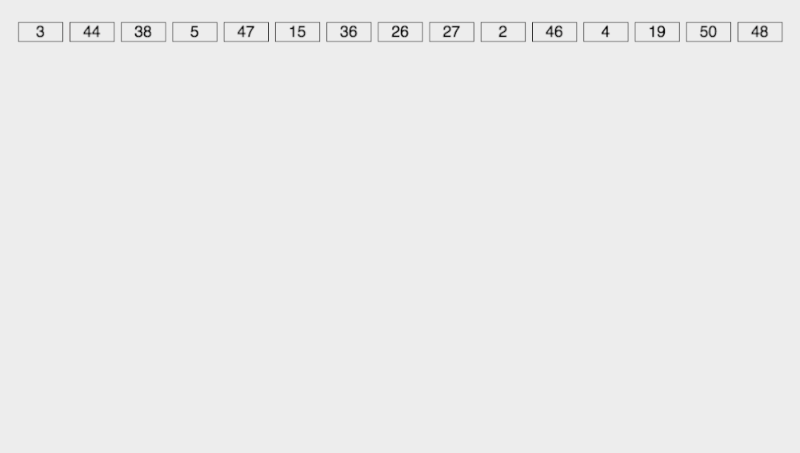
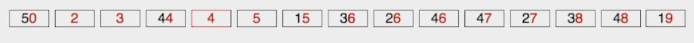

# 基数排序(Radix Sort)

多关键字排序

## 1. 算法思想

​	**基数排序是按照低位先排序，然后收集；再按照高位排序，然后再收集；依次类推，直到最高位**。有时候有些属性是有优先级顺序的，先按低优先级排序，再按高优先级排序。最后的次序就是高优先级高的在前，高优先级相同的低优先级高的在前。

## 2. 算法描述

1. 取得数组中的最大数，并取得位数；
2. array 为原始数组，从最低位开始取每个位组成 radix 数组；
3. 对 radix 进行计数排序（利用计数排序适用于小范围数的特点）

#### 动图演示



### 理解:

由低到高进行比较

每一次循环放入桶中都是根据比较位的大小放入到相应的桶中. 将低位的顺序排好,如图是根据个位进行放

此时桶中, 只看十位和个位, 十位相同的数据已经进行了排序. 比如15, 19, 再比如 44, 46, 47, 48

因为如果十位相同, 刚才按照个位进行排序. 那么就自然有序了


接下来,从桶中全部取出来之后, 再放到桶中的时候, 实现了桶中的排序(比如 44, 46, 47, 48)




## 3. 算法实现

###### 数组版

```java
public void radixSort2(int[] arr) {

    int[] buckets = new int[10];    // 准备桶, 10个位置
    int[] res = new int[arr.length];// 存放从桶中取出来的结果

    // 找出最高的位数
    int max = Integer.MIN_VALUE;
    for (int i = 0; i < arr.length; i++)
        max = arr[i] > max ? arr[i] : max;

    // 循环的次数
    int maxDigit = 0;
    while (max > 0) {
        max /= 10;
        maxDigit++;
    }

    int div = 1;
    // 进行 maxDigit趟分配, 每一次排序都会将相同位数的数的相对次序排好
    for (int i = 0; i < maxDigit; i++, div *= 10) {
        // 根据相应位数上的值把所有的数放到对应桶中
        for (int j = 0; j < arr.length; j++) {
            // 放入几号桶
            int pos = (arr[j] / div) % 10;
            buckets[pos]++;
        }

        // 再从桶中取出来, 重新放回 arr中
        // 1.累加数组
        for (int j = 1; j < buckets.length; j++) {
            buckets[j] = buckets[j] + buckets[j - 1];
        }
        // 2.将桶中的数取出来
        for (int n = arr.length - 1; n >= 0; n--) {
            // 计算出放的位置
            int pos = (arr[n] / div) % 10;
            // 计算出最大的索引值, 并且赋完值后最大索引值 -1
            int index = --buckets[pos];
            res[index] = arr[n];
        }

        // 3.下一次操作的还是 arr数组, 需要把排好的数组返回给arr
        System.arraycopy(res, 0, arr, 0, arr.length);
        // 4.清空桶
        Arrays.fill(buckets, 0);
    }
}
```

###### java List版

```java
public void radixSort(int[] arr) {
    // 算出最大数的位数
    int max = Integer.MIN_VALUE;
    for (int i = 0; i < arr.length; i++) {
        if (arr[i] > max) max = arr[i];
    }

    // 循环的次数
    int maxDigit = 0;
    while (max > 0) {
        max /= 10;
        maxDigit++;
    }

    // 10个桶,对应 0~9
    List<ArrayList<Integer>> buckets = new ArrayList<>();
    for (int i = 0; i < 10; i++)
        buckets.add(new ArrayList<>());

    int div = 1;
    // 进行 maxDigit趟分配, 每一次排序都会将相同位数的数的相对次序排好
    for (int i = 0; i < maxDigit; i++, div *= 10) {
        // 将数组中的所有数放到对应的桶中
        for (int j = 0; j < arr.length; j++) {
            // num 的值为array[j]的相应位数上的数字
            int num = (arr[j] / div) % 10;
            // 放到对应的桶中
            buckets.get(num).add(arr[j]);
        }

        // 再从桶中取出来, 重新放回 arr中
        int index = 0;
        // 对每个桶进行操作
        for (int j = 0; j < 10; j++) {
            // 将每个桶中的数放入到 arr中
            for (int k = 0; k < buckets.get(j).size(); k++)
                arr[index++] = buckets.get(j).get(k);

            // 清空操作的桶, 不是 bucket = null, 否则是空指针异常
            buckets.get(j).clear();
        }
    }
}
```

> 写的时候要仔细些, 把 i, j, k等看清楚,每次都写错

## 4. 算法分析

| 平均时间复杂度 | 最好情况 | 最坏情况 | 空间复杂度 | 排序方式 | 稳定性 |
| :------------: | :------: | :------: | :--------: | :------: | :----: |
|    O(n * k)    | O(n * k) | O(n * k) |  O(n + k)  | 内部排序 |  稳定  |

从左到右复制,前后顺序不会变, 所以是稳定的


##### 参考文章

​	[这或许是东半球讲十大排序算法最好的一篇文章](https://www.jianshu.com/p/edfa25a2b1ca)