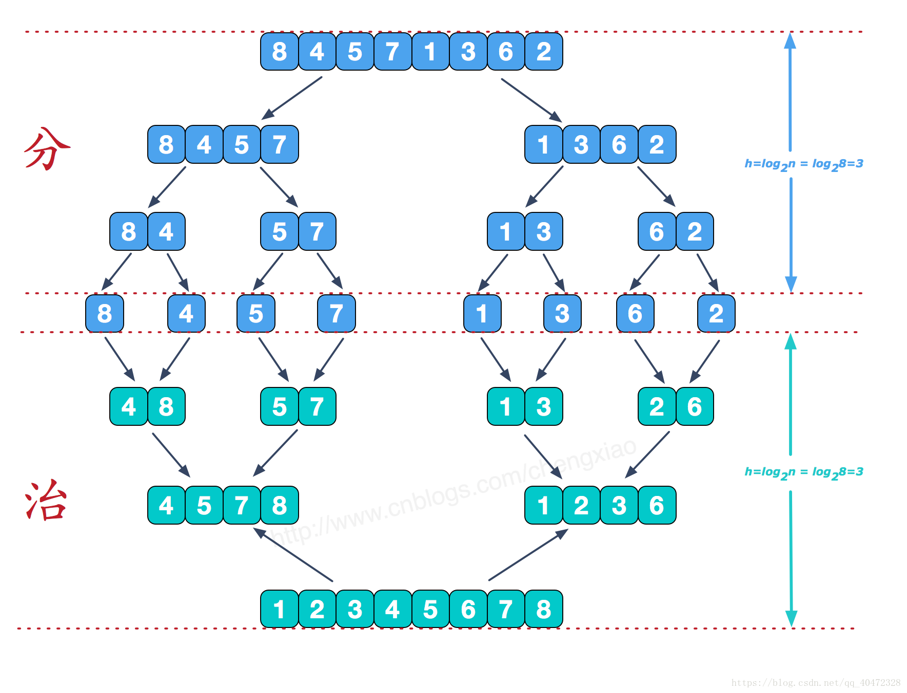

# 5. 归并排序（Merge Sort）

#### 优点

和选择排序一样，归并排序的性能不受输入数据的影响，但表现比选择排序好的多，因为始终都是O(nlogn）的时间复杂度

#### 缺点

速度虽然快了, 但是要多使用存储的空间

> Java 对象排序用的归并排序, 对象排序要求稳定

## 1. 算法思想

归并排序是逐步将多个有序子表经过若干次归并操作，最终合并为一个有序表的过程

**归并** : 将两个或多个有序表合并成一个有序表的过程

**二路归并** : 将两个有序表合并成一个有序表

> 归并的方式有多种，有二路归并, 三路归并, 四路归并, 二路归并是最常用的排序方法，它既适合内排序也是和外排序

## 2. 算法描述

1. 将有 n 个原始记录的无序表看成 **由 n个长度为1的有序子表** 组成

2. 将相邻的两个有序子表进行归并

   > 也就是将第1个表和第2个表归并，第3个表和第4个表合并…
   >
   > 若最后只剩下一个表则直接进入下一趟归并，就得到了[n/2]个长度为2或1的有序表, 称此为一趟归并

3. 重复步骤2，直到归并第 [log~2~n] 趟以后，得到一个长度为 n 的有序表为止

#### 分治法

#### 图片展示



#### 动态演示


## 3. 算法实现

#### 代码实现

```java
// 归并排序入口
public static void mergeSort(int arr[]) {
    separate(arr, 0, arr.length - 1);
}

// 对 arr[l...r]的范围进行排序
private static void separate(int[] arr, int left, int right) {

    if (left >= right) return;

    int mid = left + (right - left) / 2;
    
    separate(arr, left, mid);			// 对arr[l, mid]中的数组进行排序, 使之有序
    separate(arr, mid + 1, right);		// 对arr[mid+1, right]中的数组进行排序, 使之有序
    
    // 将两个有序数组归并为一个有序数组
    merge(arr, left, mid, mid + 1, right);
}

// 将 arr[leftPrt...leftBound]和 arr[rithtPtr...rightBound]两部分进行归并
private static void merge(int[] arr, int leftPtr, int leftBound, int rightPtr, int rightBound) {

    // 临时数组, 用于存放结果
    int[] temp = new int[rightBound - leftPtr + 1];

    int i = leftPtr;    // 左指针
    int j = rightPtr;   // 右指针
    int k = 0;          // temp的下标值

    while (i <= leftBound && j <= rightBound) {
        // 是 <=, 确保相同数字时, 前面的依然在前面, 否则就不稳定了
        temp[k++] = arr[i] <= arr[j] ? arr[i++] : arr[j++];
    }

    while (i <= leftBound) temp[k++] = arr[i++];
    while (j <= rightBound) temp[k++] = arr[j++];

    // 将 tmep赋值到 arr中
    for (int m = 0; m < temp.length; m++)
        arr[leftPtr++] = temp[m];
}
```

#### 执行过程


#### 代码优化

1. 优化一: 左右两个数组已经有序, 两个数组交界处依然有序, 则无需再进行合并
2. 优化二: 当数据量比较小时, 进行插入排序, 此时插入排序的效率要高于归并排序的效率

###### 代码

```java
public static void mergeSort(int arr[]) {
    separate(arr, 0, arr.length - 1);
}
// 对数组部分进行插入排序
private static void insertionSort(int arr[], int l, int r) {
    for (int i = l + 1; i <= r; i++) {
        int curVal = arr[i];
        int j;
        for (j = i; j > l && arr[j - 1] > curVal; j--)
            arr[j] = arr[j - 1];
        arr[j] = curVal;
    }
}

private static void separate(int[] arr, int left, int right) {

    // 优化二: 当数据量比较小时, 进行插入排序
    if (right - left <= 15) {
        insertionSort(arr, left, right);
        return;
    }

    int mid = left + (right - left) / 2;
    separate(arr, left, mid);
    separate(arr, mid + 1, right);
    // 优化一: 左右两个数组已经有序, 若两个数组交界处依然有序, 则无需再进行合并
    if (arr[mid] > arr[mid + 1])
        merge(arr, left, mid, mid + 1, right);
}
private static void merge(int[] arr, int leftPtr, int leftBound, int rightPtr, int rightBound) {
    // ... 没有变化
}
```

#### 自底向上进行实现

```java
// 自底向上实行归并排序
public static void mergeSortBU(int arr[]) {
    // sz代表每次归并数组的大小
    for (int sz = 1; sz <= arr.length; sz += sz) {
        // 每次对相邻两组进行归并排序
        // 要处理越界问题
        for (int i = 0; i + sz < arr.length; i += sz + sz) {
            // 对 arr[i...i+sz-1] 和 arr[i+sz...i+2*sz-1]进行归并
            // min函数中进行了越界问题处理
            merge(arr, i, i + sz, Math.min(i + sz + sz - 1, arr.length - 1));
        }
    }
}
public static void merge(int[] arr, int liftPtr, int rightPtr, int rightBound) {
    // ... 没有变化
}
```

## 4. 算法分析

| 平均时间复杂度 |  最好情况   |  最坏情况   | 空间复杂度 | 排序方式 | 稳定性 |
| :------------: | :---------: | :---------: | :--------: | :------: | :----: |
|  O(nlog~2~n)   | O(nlog~2~n) | O(nlog~2~n) |    O(n)    | 外部排序 |  稳定  |

### 解析

* **时间复杂度:** 归并排序的形式就是一棵二叉树，它需要遍历的次数就是二叉树的深度O(log~2~n)，合并的时候的复杂度是O(n), 而根据完全二叉树的可以得出它在任何情况下时间复杂度均是O(nlog~2~n)  
* **空间复杂度:**  归并排序空间复杂度为O(n), 需要一个辅助向量来暂存两有序子文件归并的结果
* **稳定性:** 归并排序是稳定的

