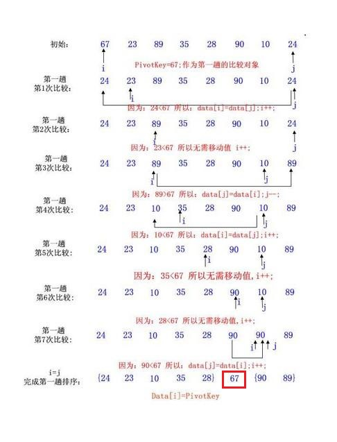
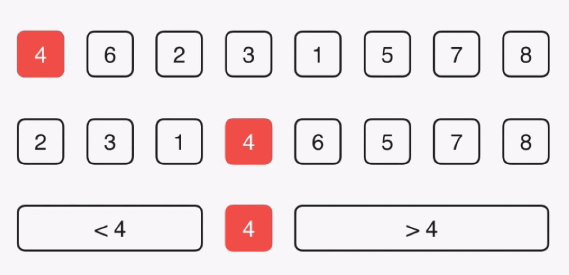
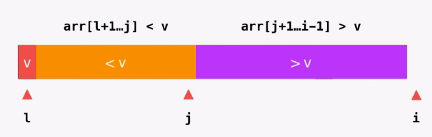
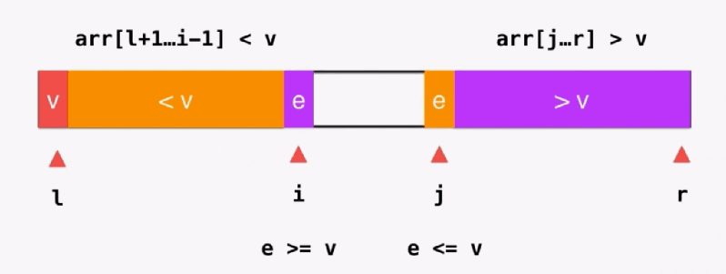
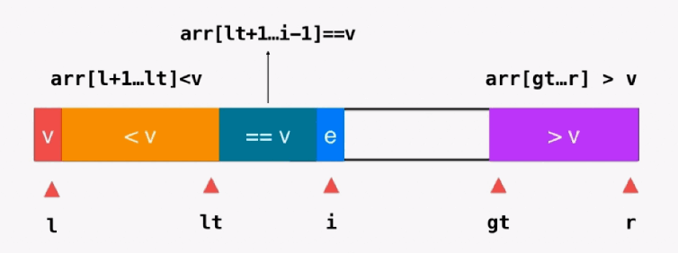
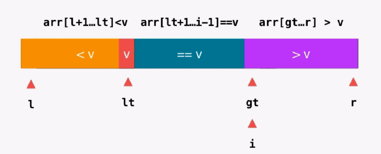

# 快速排序（Quick Sort）

20世纪最伟大的算法之一

虽然和归并排序在算法上时间复杂度都是 O(nlogn), 但是执行效率上都是比归并排序要好的.


## 1. 算法思想

快速排序是对冒泡排序的一种改进，也是目前所有排序方法中**速度最快**的一种

1. 在待排序的 n 个记录中任意选一个记录作为标准记录(通常选取序列的第1个记录作为标准记录)
2. 以该记录的关键字为基准 ，将当前的无序区划分为左右两个比较小的无序区
   - 使左边无序区中各记录的关键字**均小于**基准记录的关键字
   - 使右区无序子区中各记录的关键字**均大于或等于**基准的关键字
   - 而标准记录则位于两个无序区的中间位置上，也就是该记录最终排序的位置上
3. 分别对两个做，那个无序区继续进行上述的划分过程，直到无序区中所有的记录都被排好位置

## 2. 算法描述

快速排序使用分治法来把一个数列分为两个子数列。具体算法描述如下：

1. 从数列中挑出一个元素，称为 “基准”（pivot）；
2. 重新排序数列，所有比基准值小的元素放在基准前面，所有比基准值大的元素放在基准的后面（相同的数可以到任一边），该基准就处于数列的中间位置。这称为分区（partition）操作；
3. 递归地（recursive）对小于基准值元素的子数列和大于基准值元素的子数列进行快速排序。

#### 图片示例

###### 图片一



###### 图片二



#### 动态演示


## 3. 算法实现

### 第一版

##### 实现 partition()方法图解



###### 代码


```java
public class QuickSort {
    // 快速排序入口
    public static void quickSort(int[] arr) {
        sort(arr, 0, arr.length - 1);
    }

    // 对 arr[l...r]部分进行快速排序
    private static void sort(int[] arr, int l, int r) {
        // 递归结束条件
        if (l >= r) return;

        // 选取基准, 并将基准放到应该的位置
        int p = partition(arr, l, r);
        sort(arr, l, p - 1);
        sort(arr, p + 1, r);
    }

    // 对 arr[l...r]部分进行 partition操作
    // 返回 p, 使得 arr[l...p-1] < arr[p]; arr[p+1...r] > arr[p]
    private static int partition(int[] arr, int l, int r) {
        int val = arr[l];

        // arr[l+1...j] < val; arr[j+1...i) > val
        int j = l;  // j为分界点, i为当前访问的元素
        for (int i = l + 1; i <= r; i++) {
            if (arr[i] < val) {
                swap(arr, j + 1, i);
                j++;
            }
        }
        swap(arr, l, j);
        return j;
    }
}
```

### 进行优化

##### 快速排序和归并排序的区别

* 归并排序每次分成的两棵树都是等分
* ① 快速排序没有这个保证, 一大一小两棵树, 最坏的情况退化为 O(n^2), 在近乎有序的数组时速度很慢

  > 修改: 随机修改每次选的基准

② 如果排序数组数据量很大, 但是数据范围很小, 那么每次选取的基准值, 很可能将数组分成极其不平衡的两部分, 

> 修改: 使用挖空法

#### 进行优化

* **优化一:** 数组过小时修改为插入排序

* **优化二:** 每次选取基准修改为随机选取(很重要)
* **优化三:** 修改排序的方式

##### 实现 partition()方法图解



###### 代码

双指针+挖坑法

```java
public class QuickSort {
    // 快速排序入口
    public static void quickSort(int[] arr) {
        sort(arr, 0, arr.length - 1);
    }

    // 对 arr[l...r]部分进行快速排序
    private static void sort(int[] arr, int l, int r) {
        // 优化一: 对数组部分进行插入排序
        if (r - l <= 15) {
            insertionSort(arr, l, r);
            return;
        }

        int p = partition3(arr, l, r);
        sort(arr, l, p - 1);
        sort(arr, p + 1, r);
    }

    // 此时 left, right代表的含义均为 数组的最左和最右的下标
    private static void insertionSort(int arr[], int l, int r) {
        // i为无序组的第一个下标
        for (int i = l + 1; i <= r; i++) {
            int curVal = arr[i];	// 待插入元素的值
            int j;		// j为应该插入的位置的下标, 初始值为 i(如果不需要移动, 就是这个位置)
            for (j = i; j > l && arr[j - 1] > curVal; j--)
                // 进行移动
                arr[j] = arr[j - 1];
            // 插入到应该的位置
            arr[j] = curVal;
        }
    }
    
    // 优化三: 修改实现 partition的思路
    private static int partition(int[] arr, int l, int r) {
        // 优化二:  随机选取范围内的下标和下标为 l的进行元素交换
        Random random = new Random();
        int index = random.nextInt(r - l + 1) + l;
        swap(arr, l, index);
        int pivotVal = arr[l];

        while (l < r) {
            // 从右向左找到比 pivot小的值
            // 不要丢掉第二个条件,左右指针不能相等, 当左右指针相等时, 说明只剩下一个坑了, 不应该执行了
            while (arr[r] >= pivotVal && l < r) r--;
            // 循环结束后,将比基准小的 arr[high] 放到左边
            arr[l] = arr[r];

            while (arr[l] <= pivotVal && l < r) l++;
            arr[r] = arr[l];
        }
        // 此时只剩下一个坑了, 将基准值放到属于他的位置
        arr[l] = pivotVal;
        return l;
    }
}
```


### 三路快排(Quick Sort 3 Ways)

在处理较多重复值相同的情况下, 有很大的优势

##### 思路

之前将数组分为两部分, 即 `<V 和 >V`, 三路快排将数组分为了三部分, `<V, =V, >V`

##### 实现 partition()方法图解

###### 图一



###### 图二



###### 代码

把图中的每个变量所代表的含义弄清楚

看代码时结合上面的图进行分析

```java
public class QuickSort2 {

    // 快速排序入口
    public static void quickSort(int[] arr) {
        quickSort3Ways(arr, 0, arr.length - 1);
    }

    // 对 arr[l...r]部分进行快速排序
    private static void quickSort3Ways(int[] arr, int l, int r) {
        // 递归结束条件
        if (r - l <= 15) {
            insertionSort(arr, l, r);
            return;
        }

        // partition()
        // 随机选取范围内的下标和第一个进行交换
        Random random = new Random();
        int index = random.nextInt(r - l + 1) + l;
        swap(arr, l, index);
        int val = arr[l];

        int lt = l;       // arr[l+1...lt] < v, 三个的取值均在所需要的边界之外
        int gt = r + 1;   // arr[gt...r] > v
        int i = l + 1;    // arr[lt...i) = v

        while (i < gt) {	// 注意没有 =, 当相遇时, 不应该在继续
            if (arr[i] < val) {
                swap(arr, i, lt + 1);
                lt++;
                i++;
            } else if (arr[i] == val) {
                i++;
            } else {    // arr[i] > val
                swap(arr, i, gt - 1);
                gt--;
            }
        }
        swap(arr, l, lt);	// 将 l的元素与lt交换, 此时 lt位置上的值 = val

        quickSort3Ways(arr, l, lt - 1);	// 注意arr[lt] == val
        quickSort3Ways(arr, gt, r);
    }

    private static void swap(int[] arr, int a, int b) {
        int temp = arr[a];
        arr[a] = arr[b];
        arr[b] = temp;
    }
}
```


## 4. 算法分析

| 平均时间复杂度 |  最好情况   | 最坏情况 | 空间复杂度 | 排序方式 | 稳定性 |
| :------------: | :---------: | :------: | :--------: | :------: | :----: |
|  O(nlog~2~n)   | O(nlog~2~n) | O(n^2^)  |  O(logn)   | 内部排序 | 不稳定 |

#### 解析

* **最好情况：**基准选择得当，partition函数每次恰好能均分序列，其递归树的深度就为 log~2~n，时间复杂度为O(nlog~2~n)
* **最坏情况：**选择了最大或者最小数字作为基准，每次划分只能将序列分为一个元素与其他元素两部分，此时快速排序退化为冒泡排序，如果用树画出来，得到的将会是一棵单斜树，即所有的结点只有左（右）结点的树，树的深度为 n，时间复杂度为O(n^2^)
* **空间复杂度:**  快速排序的空间复杂度主要考虑**递归时使用的栈空间**。
   在最好情况下，即partition函数每次恰好能均分序列，空间复杂度为O(logn)；在最坏情况下，即退化为冒泡排序，空间复杂度为O(n)。平均空间复杂度为O(logn)。
* **稳定性:**  快速排序是不稳定的


## Merge Sort 和 Quick Sort的衍生问题

### 相同

都使用了分治算法

**分治算法:** 顾名思义,分而治之,就是将原问题分割成同等结构的子问题. 之后将子问题逐一解决后,原问题也就得到了解决。
