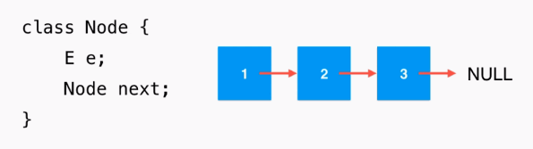
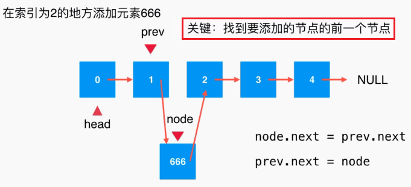
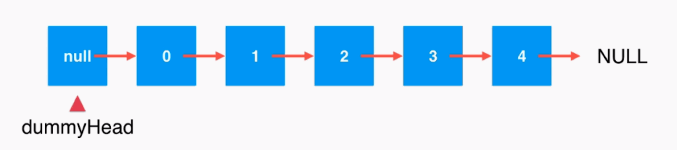
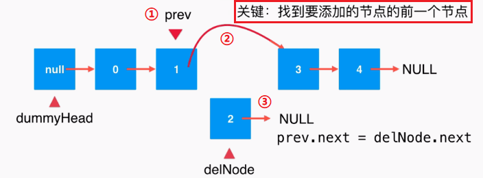

## 一. 链表

线性表的**链接存储结构**成为链表

### 1. 特点

- 用一组任意的存储单元存储线性表的数据结构(存储单元可以是连续的,也可以是不连续的
- 数据元素的逻辑次序和物理次序 **==不一定一致==**

### 2. 常见的链表

1. 单链表(每个结点有一个指针域的链表)
2. 循环链表
3. 双链表(每个结点有两个指针域的链表)

### 3. 相关概念

- **结点:** 基本单元,由两部分组成

  - 数据域: 用来存放结点本身的信息
  - 指针域:用来存放本结点的直接后继结点的地址

- **空指针:** 链表中最后一个结点的指针域不指向任何结点(通常用"∧"或者"NULL"表示

- **头指针:** 指向单链表第一个结点的指针(head)

- **空表:** 指针 head 为空指针,即 head = NULL

- **头结点(虚拟结点):** 第一个结点之前再增加一个类型相同的结点(为了便于实现链表的各种运算, 其他结点成为表结点)

- **表结点:**  除了表头结点其他的结点

  > 在表结点中,第一个结点称为 **首结点** ,最后一个结点称为 **尾结点**

### 4. 基本操作

- 基本
  - 数组中元素个数: `getsize()`
  - 数组是否为空: `isEmpty()`
  - 改变数组容量大小: `resize(int newcatacity)` (扩容, 缩容)
- 增
  - 指定位置增加: `add(int index, E e)`
  - 开头添加: `addFirst(E e)`
  - 末尾添加: `addLast(E e)`
- 删(返回元素)
  - 指定位置删除: `remove(int index)`
  - 删除首元素: `removeFirst()`
  - 删除末尾元素: `removeLast()`
  - 删除指定元素: `removeElement(E e)` (默认第一个)
- 改
  - 修改索引位置上的元素: `set(int index, E e)`
- 查
  - 获取指定位置上的元素: `get(int index)`
  - 获取首元素: `getFirst()`
  - 获取尾元素: `getLast()`
  - 查找指定元素的索引: `find(E e)`(默认第一个)
  - 是否含有元素: `contains(E e)`
- 遍历
  - 重写 `toString()`

### 5. 图解

#### 链表的结点

数据存储在 “结点”中



* **优点：**真正的动态，不需要处理理固定容量量的问题

* **缺点：**丧失了随机访问的能力

#### 添加结点



这样添加, 需要对添加位置为 0的元素拿出来单独考虑, 所以使用虚拟结点

#### 设置虚拟结点



#### 删除结点




### 6. 链表的优缺点

#### 优点

- 不需要事先估计容量
- **插入和删除** 运算方便,效率高,时间复杂度为O(1)

#### 缺点

- 查询速度慢

# 二. 代码实现

### 结点的结构

###### 代码

```java
// 结点
private class Node{
    public E e;
    public Node next;

    public Node(E e, Node next){
        this.e = e;
        this.next = next;
    }

    public Node(E e){
        this(e, null);
    }

    public Node(){
        this(null, null);
    }

    @Override
    public String toString(){
        return e.toString();
    }
}
```

### 不使用虚拟结点

###### 代码

```java
public class LinkedList<E> {
	
    // 结点
    private class Node{
        public E e;
        public Node next;

        public Node(E e, Node next){
            this.e = e;
            this.next = next;
        }

        public Node(E e){
            this(e, null);
        }

        public Node(){
            this(null, null);
        }

        @Override
        public String toString(){
            return e.toString();
        }
    }

    private Node head;  // 首结点
    private int size;   // 元素个数

    // 构造函数
    public LinkedList(){
        head = null;
        size = 0;
    }

    // 获取链表中的元素个数
    public int getSize(){
        return size;
    }

    // 返回链表是否为空
    public boolean isEmpty(){
        return size == 0;
    }

    // 在链表头添加新的元素e
    public void addFirst(E e){
//        Node node = new Node(e);
//        node.next = head;
//        head = node;
        // 更加优雅
        head = new Node(e, head);
        size ++;
    }

    // 在链表的 index(0-based)位置添加新的元素e
    // 在链表中不是一个常用的操作，练习用：）
    public void add(int index, E e){

        if(index < 0 || index > size)
            throw new IllegalArgumentException("Add failed. Illegal index.");

        if(index == 0)
            addFirst(e);
        else{
            Node prev = head;
            for(int i = 0 ; i < index - 1 ; i ++)
                prev = prev.next;

//            Node node = new Node(e);
//            node.next = prev.next;
//            prev.next = node;

            prev.next = new Node(e, prev.next);
            size ++;
        }
    }

    // 在链表末尾添加新的元素e
    public void addLast(E e){
        add(size, e);
    }
}
```

### 使用虚拟结点

###### 代码

```java
public class LinkedList<E> {

    // 结点
    private class Node {
        public E e;
        public Node next;

        public Node(E e, Node next) {
            this.e = e;
            this.next = next;
        }

        public Node(E e) {
            this(e, null);
        }

        public Node() {
            this(null, null);
        }

        @Override
        public String toString() {
            return e.toString();
        }
    }

    private Node dummyHead; // 虚拟结点, 连接头结点前的一个结点
    private int size;

    // 构造函数
    public LinkedList() {
        dummyHead = new Node(); // 初始化
        size = 0;
    }

    // 获取链表中的元素个数
    public int getSize() {
        return size;
    }

    // 返回链表是否为空
    public boolean isEmpty() {
        return size == 0;
    }

    // 在链表的index(0-based)位置添加新的元素e
    // 在链表中不是一个常用的操作，练习用：）
    public void add(int index, E e) {

        if (index < 0 || index > size)
            throw new IllegalArgumentException("Add failed. Illegal index.");

        Node prev = dummyHead;
        for (int i = 0; i < index; i++)
            prev = prev.next;

        // Node node = new Node(e);
        // node.next = prev.next;
        // prev.next = node;

        // 与上面代码结果相同, 更加优雅
        prev.next = new Node(e, prev.next);
        size++;    // 不要丢掉
    }

    // 在链表头添加新的元素e
    public void addFirst(E e) {
        add(0, e);
    }

    // 在链表末尾添加新的元素e
    public void addLast(E e) {
        add(size, e);
    }

    // 获得链表的第 index(0-based)个位置的元素 [在链表中不是一个常用的操作，练习用:)]
    public E get(int index) {

        if (index < 0 || index >= size)
            throw new IllegalArgumentException("Get failed. Illegal index.");

        Node cur = dummyHead.next;
        for (int i = 0; i < index; i++)
            cur = cur.next;
        return cur.e;
    }

    // 获得链表的第一个元素
    public E getFirst() {
        return get(0);
    }

    // 获得链表的最后一个元素
    public E getLast() {
        return get(size - 1);
    }

    // 修改链表的第 index(0-based)个位置的元素为 e [在链表中不是一个常用的操作，练习用:)]
    public void set(int index, E e) {
        if (index < 0 || index >= size)
            throw new IllegalArgumentException("Set failed. Illegal index.");

        Node cur = dummyHead.next;
        for (int i = 0; i < index; i++)
            cur = cur.next;
        cur.e = e;
    }

    // 查找链表中是否有元素 e
    public boolean contains(E e) {
        Node cur = dummyHead.next;
        while (cur != null) {
            if (cur.e.equals(e))
                return true;
            cur = cur.next;
        }
        return false;
    }

    // 从链表中删除 index(0-based)位置的元素, 返回删除的元素 [在链表中不是一个常用的操作，练习用:)]
    public E remove(int index) {
        if (index < 0 || index >= size)
            throw new IllegalArgumentException("Remove failed. Index is illegal.");

        Node prev = dummyHead;
        for (int i = 0; i < index; i++)
            prev = prev.next;

        Node retNode = prev.next;
        prev.next = retNode.next;
        retNode.next = null;
        size--;    // 不要丢掉

        return retNode.e;
    }

    // 从链表中删除第一个元素, 返回删除的元素
    public E removeFirst() {
        return remove(0);
    }

    // 从链表中删除最后一个元素, 返回删除的元素
    public E removeLast() {
        return remove(size - 1);
    }

    // 从链表中删除元素 e, 如果有多个, 删除第一个
    public void removeElement(E e) {

        // 删除和添加元素是查询元素的前一个元素, 再进行操作
        Node prev = dummyHead;
        // 循环结束位置为 prev遍历到到倒数第二个元素
        while (prev.next != null) {
            // 比较 prev后面的元素
            if (prev.next.e.equals(e))
                break;
            prev = prev.next;
        }

        // 如果 prev不是最后一个元素, 即待删除元素存在于链表中
        if (prev.next != null) {
            Node delNode = prev.next;
            prev.next = delNode.next;
            delNode.next = null;
            size--;    // 不要丢掉
        }
    }

    // 打印
    @Override
    public String toString() {
        StringBuilder res = new StringBuilder();

        Node cur = dummyHead.next;
        while (cur != null) {
            res.append(cur + "->");
            cur = cur.next;
        }
        res.append("NULL");

        return res.toString();
    }
}
```

###### 测试

```java
public class Main {
    public static void main(String[] args) {
        LinkedList linkedList = new LinkedList();
        for (int i = 0; i < 5; i++) {
            linkedList.addFirst(i);
            System.out.println(linkedList);
        }

        linkedList.add(2, 666);
        System.out.println(linkedList);

        linkedList.removeFirst();
        System.out.println(linkedList);
        linkedList.remove(2);
        System.out.println(linkedList);
        linkedList.removeLast();
        System.out.println(linkedList);
    }
}
```

###### 结果

```java
0->NULL
1->0->NULL
2->1->0->NULL
3->2->1->0->NULL
4->3->2->1->0->NULL
4->3->666->2->1->0->NULL
3->666->2->1->0->NULL
3->666->1->0->NULL
3->666->1->NULL
```

