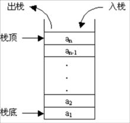

## 一. 栈的定义

* 栈也是一种线性结构相比于数组
* 栈对应的数组是数组的子集

**栈 (Stack) 又称堆栈**,是限定仅在**表尾**进行插入或删除操作的**线性表**

> 又称**后进先出** (Last In First Out , **LIFO** ) 的线性表

### 1. 概念

- **栈顶 (top)** : 表尾端 , **允许**进行插入和删除运算的一端
- **栈底 (bottom)** : 表头端, **不允许**进行插入和删除运算的一端
- **入栈(压栈)** : 向栈中插入一个新元素
- **出栈(退栈)** : 从栈中删除一个元素
- **栈顶指针** : 记录栈顶元素位置的变量
- **栈顶元素** : 处于栈顶位置的数据元素
- **空栈** : 不含任何数据元素的栈

### 2. 应用

#### 生活

- 给枪的弹夹装子弹
- 洗干净的盘子总是逐个往上叠放
- 将衣服放入衣箱中进行收藏

#### 计算机

* 撤销操作
* 程序调用的系统栈
* 括号匹配, 编译器

### 3. 基本操作

- 基本
  - 数组中元素个数: `getsize()`
  - 数组是否为空: `isEmpty()`
- 增
  - 入栈: `push(E e)`
- 删(返回元素)
  - 出栈: `pop()`
- 改 (无)
- 查
  - 查看栈顶元素: `peek()`
- 遍历
  - 重写 `toString()`

### 4. 图解

#### 栈结构



#### 入栈


#### 出栈


## 二. 代码实现

### 栈的定义

```java
public interface Stack<E> {

    int getSize();
    boolean isEmpty();
    void push(E e);     // 入栈, 数组在尾部添加
    E pop();            // 出栈, 数组在尾部删除
    E peek();
}
```

### 数组结构实现

基于之前数组实现顺序表的代码

###### 代码

```java
public class StackOfArray<E> implements Stack<E> {

    private Array<E> array;

    public StackOfArray(int capacity) {
        array = new Array<>(capacity);
    }

    public StackOfArray() {
        array = new Array<>();
    }

    @Override
    public int getSize() {
        return array.getSize();
    }

    @Override
    public boolean isEmpty() {
        return array.isEmpty();
    }

    public int getCapacity() {
        return array.getCapacity();
    }

    @Override
    public void push(E e) {
        array.addLast(e);
    }

    @Override
    public E pop() {
        return array.removeLast();
    }

    @Override
    public E peek() {
        return array.getLast();
    }

    @Override
    public String toString() {
        StringBuilder res = new StringBuilder();
        res.append("Stack: ");
        res.append('[');
        for (int i = 0; i < array.getSize(); i++) {
            res.append(array.get(i));
            if (i != array.getSize() - 1)
                res.append(", ");
        }
        res.append("] top");
        return res.toString();
    }
}
```

###### 测试

```java
public class Main {

    public static void main(String[] args) {

        StackOfArray<Integer> stack = new StackOfArray<>();

        for (int i = 0; i < 5; i++) {
            stack.push(i);
            System.out.println(stack);
        }

        stack.pop();
        System.out.println(stack);
        System.out.println("peek(): " + stack.peek());
    }
}
```

###### 结果

```java
Stack: [0] top
Stack: [0, 1] top
Stack: [0, 1, 2] top
Stack: [0, 1, 2, 3] top
Stack: [0, 1, 2, 3, 4] top
Stack: [0, 1, 2, 3] top
peek(): 3
```

### 链表结构实现

基于之前链表的代码

###### 代码

```java
public class StackOfLinkedList<E> implements Stack<E> {

    private LinkedList<E> list;

    public StackOfLinkedList() {
        list = new LinkedList<>();
    }

    @Override
    public int getSize() {
        return list.getSize();
    }

    @Override
    public boolean isEmpty() {
        return list.isEmpty();
    }

    @Override
    public void push(E e) {
        list.addFirst(e);
    }

    @Override
    public E pop() {
        return list.removeFirst();
    }

    @Override
    public E peek() {
        return list.getFirst();
    }

    @Override
    public String toString() {
        StringBuilder res = new StringBuilder();
        res.append("Stack: top ");
        res.append(list);
        return res.toString();
    }
}
```

###### 测试

```java
public static void main(String[] args) {

    StackOfLinkedList<Integer> stack = new StackOfLinkedList<>();

    for (int i = 0; i < 5; i++) {
        stack.push(i);
        System.out.println(stack);
    }

    stack.pop();
    System.out.println(stack);
}
```

###### 结果

```java
Stack: top 0->NULL
Stack: top 1->0->NULL
Stack: top 2->1->0->NULL
Stack: top 3->2->1->0->NULL
Stack: top 4->3->2->1->0->NULL
Stack: top 3->2->1->0->NULL
```

