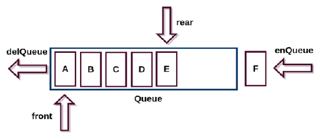
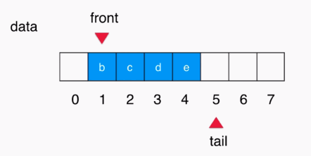
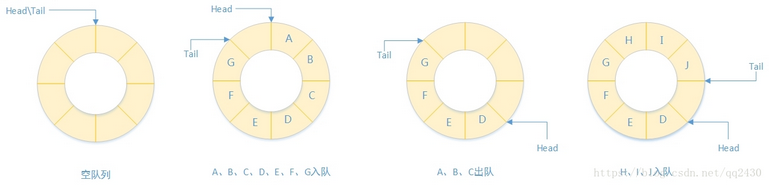
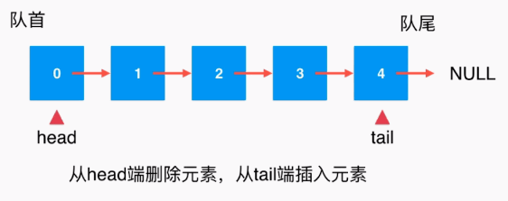

## 一. 队列

- 队列也是一种线性结构相比于数组
- 队列对应的数组是数组的子集

​	**队列**简称队 , 一种运算受限的线性表，其限定是**只允许在线性表的一端进行插入运算，而在另一端进行删除运算**

> 又称**先进先出** (First In First Out, **FIFO** )的线性表

### 1. 概念

- **队头** : 允许进行删除的一端
- **队尾** : 允许插入的一端
- **进队(入队)** : 在队列中插入一个新元素的操作
- **出队(离队)** : 从队列中删除一个元素的操作
- **空队列** : 队列中没有元素

### 2. 例子

- 排队买火车票
- 排队买饭

### 3. 基本操作

- 基本
  - 数组中元素个数: `getsize()`
  - 数组是否为空: `isEmpty()`
- 增
  - 入队: `enqueue(E e)`
- 删(返回元素)
  - 出栈: `deqeueu()`
- 改 (无)
- 查
  - 查看队首元素: `getFront()`
- 遍历
  - 重写 `toString()`

### 4. 图解

#### 普通队列



#### 循环队列

##### 图一



##### 图二



#### 链表实现




## 二. 代码实现

### 队列的定义

```java
public interface Queue<E> {

    int getSize();
    boolean isEmpty();
    void enqueue(E e);  // 入队, 数组尾部为队尾
    E dequeue();        // 出队, 数组头部位队首
    E getFront();       // 查看队首元素
}
```

### 数组结构实现

基于之前数组实现顺序表的代码

#### a. 普通队列

###### 代码

```java
public class QueueOfArray<E> implements Queue<E> {

    private Array<E> array;

    public QueueOfArray(int capacity) {
        array = new Array<>(capacity);
    }

    public QueueOfArray() {
        array = new Array<>();
    }

    @Override
    public int getSize() {
        return array.getSize();
    }

    @Override
    public boolean isEmpty() {
        return array.isEmpty();
    }

    public int getCapacity() {
        return array.getCapacity();
    }

    @Override
    public void enqueue(E e) {
        array.addLast(e);
    }

    @Override
    public E dequeue() {
        return array.removeFirst();
    }

    @Override
    public E getFront() {
        return array.getFirst();
    }

    @Override
    public String toString() {
        StringBuilder res = new StringBuilder();
        res.append("Queue: ");
        res.append("front [");
        for (int i = 0; i < array.getSize(); i++) {
            res.append(array.get(i));
            if (i != array.getSize() - 1)
                res.append(", ");
        }
        res.append("] tail");
        return res.toString();
    }
}
```

###### 测试

```java
public static void main(String[] args) {

    QueueOfArray<Integer> queue = new QueueOfArray<>();
    for (int i = 0; i < 5; i++) {
        queue.enqueue(i);
        System.out.println(queue);
    }
    for (int i = 0; i < queue.getSize(); i++) {
        if (i % 2 == 0) {
            queue.dequeue();
            System.out.println(queue);
        }
    }
    System.out.println("查看队首元素: " + queue.getFront());
}
```

###### 结果

```java
Queue: front [0] tail
Queue: front [0, 1] tail
Queue: front [0, 1, 2] tail
Queue: front [0, 1, 2, 3] tail
Queue: front [0, 1, 2, 3, 4] tail
Queue: front [1, 2, 3, 4] tail
Queue: front [2, 3, 4] tail
查看队首元素: 2
```

#### b. 循环队列

###### 代码

```java
public class LoopQueue<E> implements Queue<E> {

    private E[] data;
    private int front;   // 队首指针, 指向队首第一个元素
    private int tail;    // 队尾指针, 指向队尾最后一个元素的后一个位置, 这个位置空出来, 不添加元素
    private int size;

    // 构造函数, 进行初始化
    public LoopQueue(int capacity) {
        data = (E[]) new Object[capacity + 1];
        front = 0;
        tail = 0;
        size = 0;
    }

    public LoopQueue() {
        this(10);
    }

    public int getCapacity() {
        return data.length - 1;
    }

    @Override
    public boolean isEmpty() {
        return front == tail;
    }

    @Override
    public int getSize() {
        return size;
    }

    @Override
    public void enqueue(E e) {

        if ((tail + 1) % data.length == front)  // 此时队列已经满了
            resize(getCapacity() * 2);

        data[tail] = e;
        // 实现循环结构
        tail = (tail + 1) % data.length;
        size++;
    }

    @Override
    public E dequeue() {

        if (isEmpty())
            throw new IllegalArgumentException("Cannot dequeue from an empty queue.");

        E ret = data[front];
        data[front] = null;
        // 实现循环结构
        front = (front + 1) % data.length;
        size--;

        if (size == getCapacity() / 4 && getCapacity() / 2 != 0)
            resize(getCapacity() / 2);
        return ret;
    }

    @Override
    public E getFront() {
        if (isEmpty())
            throw new IllegalArgumentException("Queue is empty.");
        return data[front];
    }

    // 重写 resize
    private void resize(int newCapacity) {

        E[] newData = (E[]) new Object[newCapacity + 1];

        // 赋值
        for (int i = 0; i < size; i++)
            newData[i] = data[(i + front) % data.length];

        // 重新赋值
        data = newData;
        front = 0;
        tail = size;
    }

    @Override
    public String toString() {

        StringBuilder res = new StringBuilder();
        res.append(String.format("Queue: size = %d , capacity = %d/n", size, getCapacity()));
        res.append("front [");
        for (int i = front; i != tail; i = (i + 1) % data.length) {
            res.append(data[i]);
            if ((i + 1) % data.length != tail)
                res.append(", ");
        }
        res.append("] tail");
        return res.toString();
    }
}
```

###### 测试

```java
public static void main(String[] args) {

    LoopQueue<Integer> queue = new LoopQueue<>();
    for (int i = 0; i < 5; i++) {
        queue.enqueue(i);
        System.out.println(queue);
        System.out.println("----------------------------------");
    }
    for (int i = 0; i < queue.getSize(); i++) {
        if (i % 2 == 0) {
            queue.dequeue();
            System.out.println(queue);
            System.out.println("----------------------------------");
        }
    }
    System.out.println("查看队首元素: " + queue.getFront());
}
```

###### 结果

```java
Queue: size = 1 , capacity = 10
front [0] tail
----------------------------------
Queue: size = 2 , capacity = 10
front [0, 1] tail
----------------------------------
Queue: size = 3 , capacity = 10
front [0, 1, 2] tail
----------------------------------
Queue: size = 4 , capacity = 10
front [0, 1, 2, 3] tail
----------------------------------
Queue: size = 5 , capacity = 10
front [0, 1, 2, 3, 4] tail
----------------------------------
Queue: size = 4 , capacity = 10
front [1, 2, 3, 4] tail
----------------------------------
Queue: size = 3 , capacity = 10
front [2, 3, 4] tail
----------------------------------
查看队首元素: 2
```


### 链表结构实现

###### 代码

```java
public class QueueOfLinkedList<E> implements Queue<E> {

    private class Node {
        public E e;
        public Node next;

        public Node(E e, Node next) {
            this.e = e;
            this.next = next;
        }

        public Node(E e) {
            this(e, null);
        }

        public Node() {
            this(null, null);
        }

        @Override
        public String toString() {
            return e.toString();
        }
    }

    private Node head, tail;
    private int size;

    public QueueOfLinkedList() {
        head = null;    // 头指针, 指向队列头结点
        tail = null;    // 尾指针, 指向队列尾部
        size = 0;
    }

    @Override
    public int getSize() {
        return size;
    }

    @Override
    public boolean isEmpty() {
        return size == 0;
    }

    @Override
    public void enqueue(E e) {
        // 空队列插入第一个元素
        if (tail == null) {
            tail = new Node(e);
            head = tail;
        } else {
            tail.next = new Node(e);
            tail = tail.next;
        }
        size++;
    }

    @Override
    public E dequeue() {
        if (isEmpty())
            throw new IllegalArgumentException("Cannot dequeue from an empty queue.");

        Node retNode = head;
        head = head.next;
        retNode.next = null;    // 清空
        // 如果删除的是最后一个元素
        if (head == null)
            tail = null;
        size--;
        return retNode.e;
    }

    @Override
    public E getFront() {
        if (isEmpty())
            throw new IllegalArgumentException("Queue is empty.");
        return head.e;
    }

    @Override
    public String toString() {
        StringBuilder res = new StringBuilder();
        res.append("Queue: front ");

        Node cur = head;
        while (cur != null) {
            res.append(cur + "->");
            cur = cur.next;
        }
        res.append("NULL tail");
        return res.toString();
    }
}
```

###### 测试

```java
public static void main(String[] args) {

    QueueOfLinkedList<Integer> queue = new QueueOfLinkedList<>();
    for (int i = 0; i < 5; i++) {
        queue.enqueue(i);
        System.out.println(queue);
        System.out.println("----------------------------------");
    }
    for (int i = 0; i < queue.getSize(); i++) {
        if (i % 2 == 0) {
            queue.dequeue();
            System.out.println(queue);
            System.out.println("----------------------------------");
        }
    }
    System.out.println("查看队首元素: " + queue.getFront());
}
```

###### 结果

```java
Queue: front 0->NULL tail
----------------------------------
Queue: front 0->1->NULL tail
----------------------------------
Queue: front 0->1->2->NULL tail
----------------------------------
Queue: front 0->1->2->3->NULL tail
----------------------------------
Queue: front 0->1->2->3->4->NULL tail
----------------------------------
Queue: front 1->2->3->4->NULL tail
----------------------------------
Queue: front 2->3->4->NULL tail
----------------------------------
查看队首元素: 2
```


## 三. 扩展

### 常见的链表

1. 单链表(每个结点有一个指针域的链表)
2. 循环链表
3. 双链表(每个结点有两个指针域的链表)