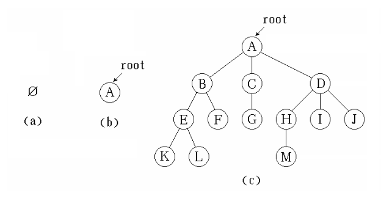
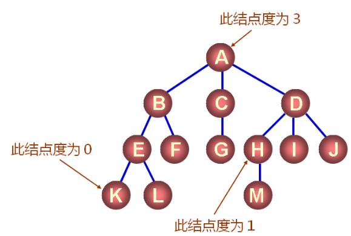
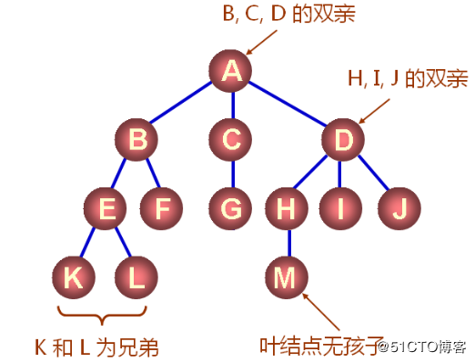
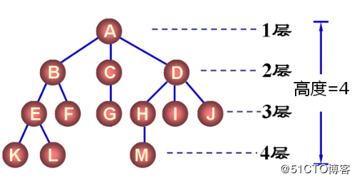
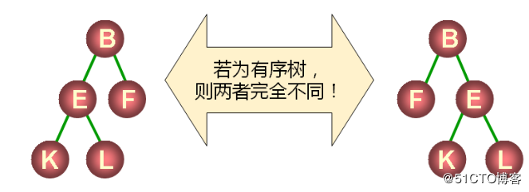
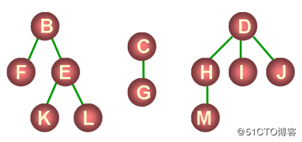

# 一. 基本概念

​	树是 **树型结构** 的简称，是一种非常重要的**非线性**数据结构，它可以很好的描述，客观世界中广泛存在的**具有分支关系或层次特性的对象** 

### 应用

- 操作系统中的文件管理
- 数据库系统中的信息组织形式
- 行政组织机构
- 人类社会的族谱

## 1. 树的定义

**树是一种非线性的数据结构** ，是由 n（n >=0）个结点组成的有限集合

- 如果 n = 0 ，树为 **空树**, 空树也是一棵树
- 如果 n > 0 ，树为 **非空树**
  1. 有且仅有一个特定的结点，称为 **根结点**（根结点只有直接后继，没有直接前驱）
  2. 除根结点以外的其余结点，可分为 m (m >= 0) 个互不相交的有限集T1, T2, … Tm, 其中**每个集合本身又是一棵树**并**称为根的子树**

#### 图示

## 2. 树的基本术语

### 1) 结点的度 和 树的度

树的结点包含 **一个数据** 和 **多个指向子树的分支**

- **结点的度** : 结点拥有的子树的数量 (度为0的结点是叶结点, 度不为0的结点为分支结点)
- **树的度** : 树的**所有结点的度的最大值**

> 该树的度为3

### 2) 叶子结点 和 分支结点

- **叶子结点(终端结点)** : 度为 0 的结点
- **分支结点(非终端结点)** : 度不为 0 的结点

### 3) 双亲结点, 孩子结点, 兄弟结点

树中的**每个结点的子树的根** 称为**该结点的孩子**，该结点称为 **孩子结点的双亲**

同一个双亲的孩子之间**互称兄弟**

### 4) 结点的层数 和 树的高度

**结点的层数** : 结点的层次从根开始定义, 根为第1层，根的孩子为第2层

**树的深度 (高度)** : 树中结点的最大层次

### 5) 堂兄弟

**双亲在同一层的结点**互称堂兄弟

如 4 中的 F 与G, H, I, J 互为 堂兄弟

### 6) 有序树和无序树

- **有序树** : 树中结点的各子树从左到右是有次序的，且相对次序不能变
- **无序树** : 非有序树

### 7) 森林

由 n 棵 **互不相交** 的树组成的集合

三棵树组成的森林如下:

------

##### 参考文章

​	[数据结构（十三）——树](https://blog.51cto.com/9291927/2068745)

​	数据结构 — 严蔚敏

​	数据结构 — 田鲁怀