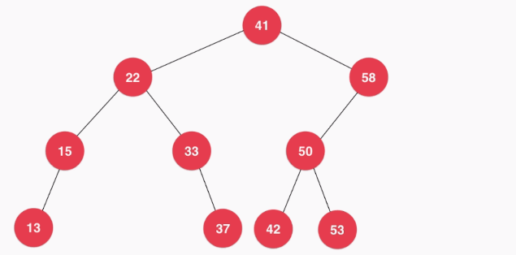

## 二叉搜索树

### 1. 定义

二叉搜索树又称二叉排序树 (Binary Sort Tree) , 它是一种特殊的二叉树,每个节点比其左子树元素大，比其右子树元素小。

### 2. 性质

它是一棵空树；或者是具有以下性质的二叉树：

1. 若它的左子树不空，则**左子树上所有结点的值均小于**它的根结点的值；
2. 若它的右子树不空，则**右子树上所有结点的值均大于**它的根结点的值；
3. 它的左右子树也分别为二叉搜索树。

#### 如图所示



我们的二叉搜索树不包含重复元素


### 代码

```java
public class BST<E extends Comparable<E>> {

    // 结点
    private class Node {
        public E e;
        public Node left, right;

        public Node(E e) {
            this.e = e;
            left = null;
            right = null;
        }
    }

    private Node root;  // 根节点
    private int size;   // 树的结点个数

    // 构造函数, 初始化数据
    public BST() {
        root = null;
        size = 0;
    }

    public int size() {
        return size;
    }

    public boolean isEmpty() {
        return size == 0;
    }

    // 向二分搜索树中添加新的元素 e
    public void add(E e) {
        root = add(root, e);
    }

    // 向以 node为根的二分搜索树中插入元素 e，递归算法
    // 返回插入新节点后二分搜索树的根
    private Node add(Node node, E e) {

        // 递归结束条件, 空树
        if (node == null) {
            size++;
            return new Node(e);
        }

        if (e.compareTo(node.e) < 0)
            node.left = add(node.left, e);
        else if (e.compareTo(node.e) > 0)
            node.right = add(node.right, e);

        return node;
    }

    // 看二分搜索树中是否包含元素 e
    public boolean contains(E e) {
        return contains(root, e);
    }

    // 看以node为根的二分搜索树中是否包含元素 e, 递归算法
    private boolean contains(Node node, E e) {

        if (node == null)
            return false;

        if (e.compareTo(node.e) == 0)
            return true;
        else if (e.compareTo(node.e) < 0)
            return contains(node.left, e);
        else // e.compareTo(node.e) > 0
            return contains(node.right, e);
    }

    // 二分搜索树的前序遍历
    public void preOrder() {
        preOrder(root);
    }

    // 前序遍历以 node为根的二分搜索树, 递归算法
    private void preOrder(Node node) {

        if (node == null)
            return;

        System.out.println(node.e);
        preOrder(node.left);
        preOrder(node.right);
    }

    // 二分搜索树的非递归前序遍历
    public void preOrderNR() {

        Stack<Node> stack = new Stack<>();
        stack.push(root);
        while (!stack.isEmpty()) {
            Node cur = stack.pop();
            System.out.println(cur.e);

            if (cur.right != null)
                stack.push(cur.right);
            if (cur.left != null)
                stack.push(cur.left);
        }
    }

    // 二分搜索树的中序遍历
    public void inOrder() {
        inOrder(root);
    }

    // 中序遍历以 node为根的二分搜索树, 递归算法
    private void inOrder(Node node) {

        if (node == null)
            return;

        inOrder(node.left);
        System.out.println(node.e);
        inOrder(node.right);
    }

    // 二分搜索树的后序遍历
    public void postOrder() {
        postOrder(root);
    }

    // 后序遍历以 node为根的二分搜索树, 递归算法
    private void postOrder(Node node) {

        if (node == null)
            return;

        postOrder(node.left);
        postOrder(node.right);
        System.out.println(node.e);
    }

    // 二分搜索树的层序遍历
    public void levelOrder() {

        Queue<Node> q = new LinkedList<>();
        q.add(root);
        while (!q.isEmpty()) {
            Node cur = q.remove();
            System.out.println(cur.e);

            if (cur.left != null)
                q.add(cur.left);
            if (cur.right != null)
                q.add(cur.right);
        }
    }

    // 寻找二分搜索树的最小元素
    public E minimum() {
        if (size == 0)
            throw new IllegalArgumentException("BST is empty!");

        return minimum(root).e;
    }

    // 返回以node为根的二分搜索树的最小值所在的节点
    private Node minimum(Node node) {
        if (node.left == null)
            return node;
        return minimum(node.left);
    }

    // 寻找二分搜索树的最大元素
    public E maximum() {
        if (size == 0)
            throw new IllegalArgumentException("BST is empty");

        return maximum(root).e;
    }

    // 返回以 node为根的二分搜索树的最大值所在的节点
    private Node maximum(Node node) {
        if (node.right == null)
            return node;

        return maximum(node.right);
    }

    // 从二分搜索树中删除最小值所在节点, 返回最小值
    public E removeMin() {
        E ret = minimum();
        root = removeMin(root);
        return ret;
    }

    // 删除掉以 node为根的二分搜索树中的最小节点
    // 返回删除节点后新的二分搜索树的根
    private Node removeMin(Node node) {

        // 递归结束条件, 找到最小值结点
        if (node.left == null) {
            Node rightNode = node.right;    // 获得右子树
            node.right = null;
            size--;
            return rightNode;   // 返回右子树
        }

        node.left = removeMin(node.left);   // 连接最小值结点的右子树
        return node;
    }

    // 从二分搜索树中删除最大值所在节点
    public E removeMax() {
        E ret = maximum();
        root = removeMax(root);
        return ret;
    }

    // 删除掉以 node为根的二分搜索树中的最大节点
    // 返回删除节点后新的二分搜索树的根
    private Node removeMax(Node node) {

        if (node.right == null) {
            Node leftNode = node.left;  // 获得左子树
            node.left = null;
            size--;
            return leftNode;    // 返回左子树
        }

        node.right = removeMax(node.right); // 连接最大值结点的左子树
        return node;
    }

    // 从二分搜索树中删除元素为 e的节点
    public void remove(E e) {
        root = remove(root, e);
    }

    // 删除掉以 node为根的二分搜索树中值为 e的节点, 递归算法
    // 返回删除节点后新的二分搜索树的根
    private Node remove(Node node, E e) {

        if (node == null)
            return null;

        if (e.compareTo(node.e) < 0) {
            node.left = remove(node.left, e);
            return node;
        } else if (e.compareTo(node.e) > 0) {
            node.right = remove(node.right, e);
            return node;
        } else {   // e.compareTo(node.e) == 0

            // 待删除节点左子树为空的情况
            if (node.left == null) {
                Node rightNode = node.right;
                node.right = null;
                size--;
                return rightNode;   // 返回删除结点的右子树
            }

            // 待删除节点右子树为空的情况
            if (node.right == null) {
                Node leftNode = node.left;
                node.left = null;
                size--;
                return leftNode;    // 返回删除结点的左子树
            }

            // 待删除节点左右子树均不为空的情况, 比较麻烦

            // 找到比待删除节点大的最小节点, 即待删除节点右子树的最小节点
            Node successor = minimum(node.right);
            // 用这个节点顶替待删除节点的位置
            successor.right = removeMin(node.right);    // 删除 successor结点, 并且进行连接
            successor.left = node.left;

            node.left = node.right = null;

            return successor;
        }
    }

    // 遍历该树
    @Override
    public String toString() {
        StringBuilder res = new StringBuilder();
        generateBSTString(root, 0, res);
        return res.toString();
    }

    // 生成以 node为根节点，深度为 depth的描述二叉树的字符串
    private void generateBSTString(Node node, int depth, StringBuilder res) {

        if (node == null) {
            res.append(generateDepthString(depth) + "null/n");
            return;
        }

        res.append(generateDepthString(depth) + node.e + "/n");
        generateBSTString(node.left, depth + 1, res);
        generateBSTString(node.right, depth + 1, res);
    }

    private String generateDepthString(int depth) {
        StringBuilder res = new StringBuilder();
        for (int i = 0; i < depth; i++)
            res.append("--");
        return res.toString();
    }
}
```


