## 一. AVL概念

### 1. 概念

平衡二叉树是一种特殊的二叉搜索树,所以平衡二叉树的性质包含二叉搜索树的性质

平衡二叉树又被称为 AVL 树, 形态均匀的二叉搜索树 

> 很好的解决了二叉搜索树退化成链表的问题

名字的由来

​	由 Adelson-Velskii 和 Landis 提出了一个动态保持 BST 树的方法, 将这种方式得到的平衡二叉树, **简称为 AVL树**

### 2. 定义

平衡二叉树的左子树和右子树都是平衡二叉树，**且左子树和右子树的深度之差(高度差)的绝对值不超过 1**

#### 如图

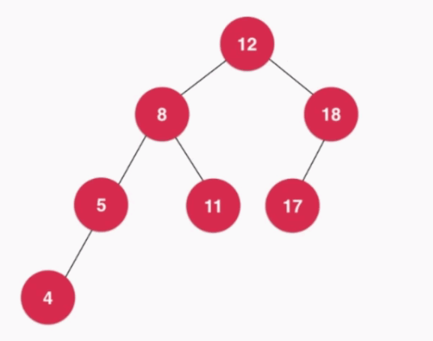

该树也是一颗平衡二叉树

平衡二叉树的高度和结点数量之间的关系也是 O(logn)

#### 标注结点的高度

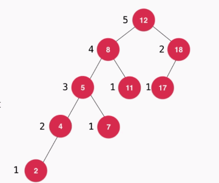

#### 计算平衡因子

**平衡因子:**  把二叉搜索树中每个结点左子树的深度减去右子树的深度之后的值(Balanced Factor, BF) , 因此 , **平衡二叉树所有结点的平衡因子只可能是 -1, 0, 1**

###### 图一

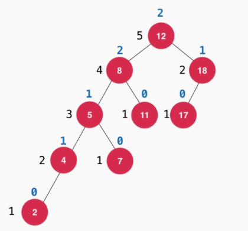

蓝色字体为该树的平衡因子, 该树不是平衡二叉树

###### 图二

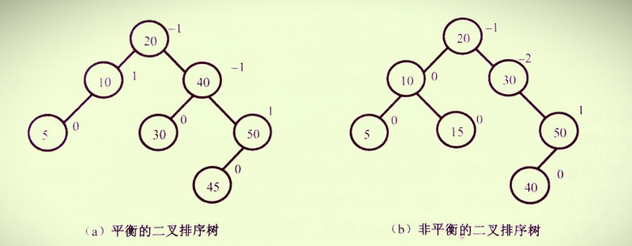


## 二. AVL树维护

#### 在什么时候进行维护?

加入节点后, 沿着节点向上维护平衡性, 检查与之相关联的每个祖先节点都是否满足平衡平衡二叉树的性质

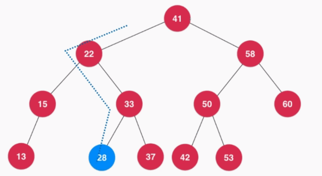

在这种情况, 平衡因子的绝对值 >= 2时. 不满足平衡二叉树的性质, 进行维护, 如图中的两个绿色结点

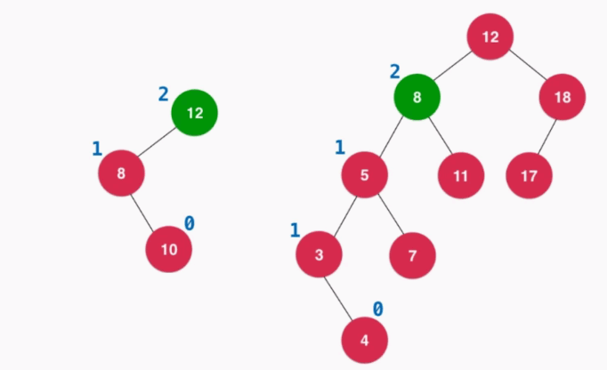

### 维护情况分类

**核心:** 如果需要维护, 说明有一方的树太高了, 如果想要保持平衡, 必须让高的一方变矮, 矮的一方变高. 就需要更换问题出现问题的结点, 让他向下移动. 这样就能保持平衡了

#### 1. LL型

插入的元素在不平衡的节点的**左侧的左侧**, 进行右旋转

###### 举例

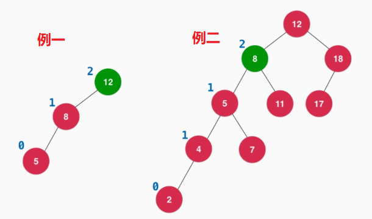

###### 维护动态图


###### 具体操作

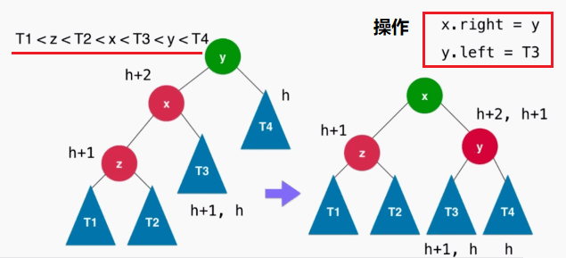

#### 2. RR

插入的元素在不平衡的节点的**右侧的右侧**, 进行左旋转

###### 举例

具体操作的图一

###### 操作动态图


###### 具体操作

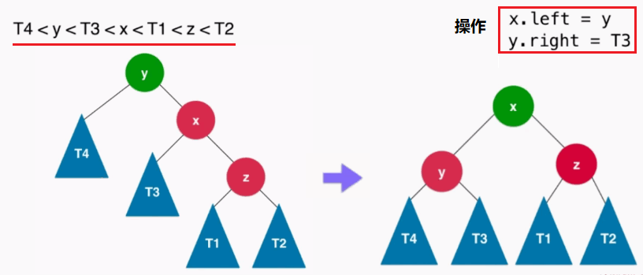

#### 3. LR

插入的元素在不平衡的节点的左侧的右侧

######  举例

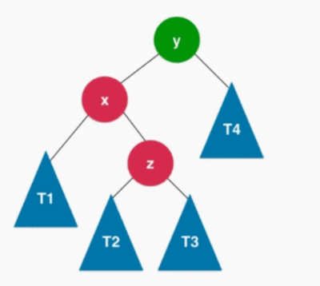

###### 具体操作

调整, 对 X进行左旋转, 转化为了 LL型的情况, 再解决 LL型的情况

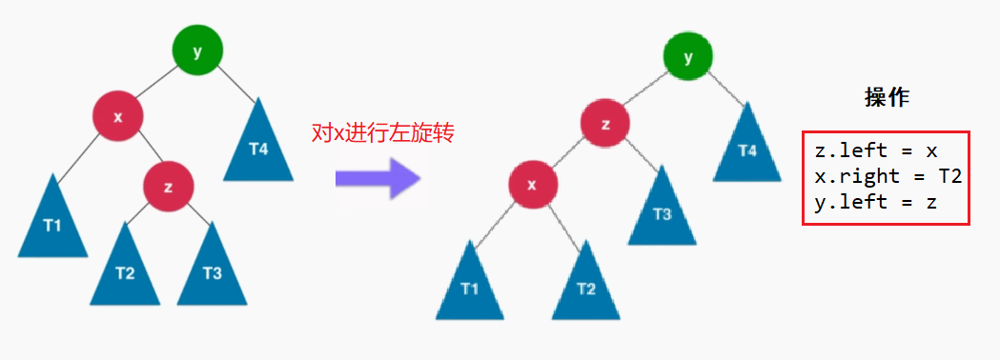

#### 4. RL

插入的元素在不平衡的节点的右侧的左侧

######  举例

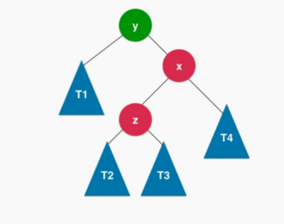

调整, 对X进行右旋转, 转化为了 RR型的情况, 再解决 RR型的情况

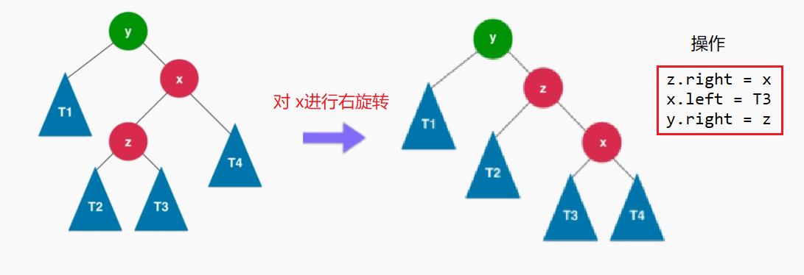

### 3. 总结

在插入的过程中，会出现的四种情况破坏AVL树的特性，我们可以采取如下相应的旋转。

1. 左-左型(LL)：做右旋。
2. 右-右型(RR)：做左旋转。
3. 左-右型(LR)：先做左旋，后做右旋。
4. 右-左型(RL)：先做右旋，再做左旋。


### 三. 代码

###### Java版

```java
public class AVLTree<K extends Comparable<K>, V> {

    private class Node{
        public K key;
        public V value;
        public Node left, right;
        public int height;		// 记录高度值

        public Node(K key, V value){
            this.key = key;
            this.value = value;
            left = null;
            right = null;
            height = 1;		// 默认为 1
        }
    }

    private Node root;	// 根节点
    private int size;	// 树的节点个数

    // 构造函数, 懒加载
    public AVLTree(){
        root = null;
        size = 0;
    }

    public int getSize(){
        return size;
    }

    public boolean isEmpty(){
        return size == 0;
    }

    // 判断该二叉树是否是一棵二分搜索树
    public boolean isBST(){
        ArrayList<K> keys = new ArrayList<>();
        inOrder(root, keys);
        for(int i = 1 ; i < keys.size() ; i ++)
            if(keys.get(i - 1).compareTo(keys.get(i)) > 0)
                return false;
        return true;
    }

    private void inOrder(Node node, ArrayList<K> keys){

        if(node == null)
            return;

        inOrder(node.left, keys);
        keys.add(node.key);
        inOrder(node.right, keys);
    }

    // 判断该二叉树是否是一棵平衡二叉树
    public boolean isBalanced(){
        return isBalanced(root);
    }

    // 判断以Node为根的二叉树是否是一棵平衡二叉树，递归算法
    private boolean isBalanced(Node node){
        if(node == null)
            return true;

        int balanceFactor = getBalanceFactor(node);
        if(Math.abs(balanceFactor) > 1)
            return false;
        return isBalanced(node.left) && isBalanced(node.right);
    }

    // 获得节点node的高度
    private int getHeight(Node node){
        if(node == null)
            return 0;
        return node.height;
    }

    // 获得节点node的平衡因子
    private int getBalanceFactor(Node node){
        if(node == null)
            return 0;
        return getHeight(node.left) - getHeight(node.right);
    }

    // 对节点y进行向右旋转操作，返回旋转后新的根节点x
    //        y                              x
    //       / /                           /   /
    //      x   T4     向右旋转 (y)        z     y
    //     / /       - - - - - - - ->    / /   / /
    //    z   T3                       T1  T2 T3 T4
    //   / /
    // T1   T2
    private Node rightRotate(Node y) {
        Node x = y.left;
        Node T3 = x.right;

        // 向右旋转过程
        x.right = y;
        y.left = T3;

        // 更新height
        y.height = Math.max(getHeight(y.left), getHeight(y.right)) + 1;
        x.height = Math.max(getHeight(x.left), getHeight(x.right)) + 1;

        return x;
    }

    // 对节点y进行向左旋转操作，返回旋转后新的根节点x
    //    y                             x
    //  /  /                          /   /
    // T1   x      向左旋转 (y)       y     z
    //     / /   - - - - - - - ->   / /   / /
    //   T2  z                     T1 T2 T3 T4
    //      / /
    //     T3 T4
    private Node leftRotate(Node y) {
        Node x = y.right;
        Node T2 = x.left;

        // 向左旋转过程
        x.left = y;
        y.right = T2;

        // 更新height
        y.height = Math.max(getHeight(y.left), getHeight(y.right)) + 1;
        x.height = Math.max(getHeight(x.left), getHeight(x.right)) + 1;

        return x;
    }

    // 向二分搜索树中添加新的元素(key, value)
    public void add(K key, V value){
        root = add(root, key, value);
    }

    // 向以node为根的二分搜索树中插入元素(key, value)，递归算法
    // 返回插入新节点后二分搜索树的根
    private Node add(Node node, K key, V value){

        if(node == null){
            size ++;
            return new Node(key, value);
        }

        if(key.compareTo(node.key) < 0)
            node.left = add(node.left, key, value);
        else if(key.compareTo(node.key) > 0)
            node.right = add(node.right, key, value);
        else // key.compareTo(node.key) == 0
            node.value = value;

        // 更新height
        node.height = 1 + Math.max(getHeight(node.left), getHeight(node.right));

        // 计算平衡因子
        int balanceFactor = getBalanceFactor(node);

        // 平衡维护
        // LL
        if (balanceFactor > 1 && getBalanceFactor(node.left) >= 0)
            return rightRotate(node);

        // RR
        if (balanceFactor < -1 && getBalanceFactor(node.right) <= 0)
            return leftRotate(node);

        // LR
        if (balanceFactor > 1 && getBalanceFactor(node.left) < 0) {
            node.left = leftRotate(node.left);
            return rightRotate(node);
        }

        // RL
        if (balanceFactor < -1 && getBalanceFactor(node.right) > 0) {
            node.right = rightRotate(node.right);
            return leftRotate(node);
        }

        return node;
    }

    // 返回以node为根节点的二分搜索树中，key所在的节点
    private Node getNode(Node node, K key){

        if(node == null)
            return null;

        if(key.equals(node.key))
            return node;
        else if(key.compareTo(node.key) < 0)
            return getNode(node.left, key);
        else // if(key.compareTo(node.key) > 0)
            return getNode(node.right, key);
    }

    public boolean contains(K key){
        return getNode(root, key) != null;
    }

    public V get(K key){
        Node node = getNode(root, key);
        return node == null ? null : node.value;
    }

    public void set(K key, V newValue){
        Node node = getNode(root, key);
        if(node == null)
            throw new IllegalArgumentException(key + " doesn't exist!");

        node.value = newValue;
    }

    // 返回以node为根的二分搜索树的最小值所在的节点
    private Node minimum(Node node){
        if(node.left == null)
            return node;
        return minimum(node.left);
    }

    // 从二分搜索树中删除键为key的节点
    public V remove(K key){

        Node node = getNode(root, key);
        if(node != null){
            root = remove(root, key);
            return node.value;
        }
        return null;
    }

    private Node remove(Node node, K key){

        if( node == null )
            return null;

        Node retNode;
        if( key.compareTo(node.key) < 0 ){
            node.left = remove(node.left , key);
            // return node;
            retNode = node;
        }
        else if(key.compareTo(node.key) > 0 ){
            node.right = remove(node.right, key);
            // return node;
            retNode = node;
        }
        else{   // key.compareTo(node.key) == 0

            // 待删除节点左子树为空的情况
            if(node.left == null){
                Node rightNode = node.right;
                node.right = null;
                size --;
                // return rightNode;
                retNode = rightNode;
            }

            // 待删除节点右子树为空的情况
            else if(node.right == null){
                Node leftNode = node.left;
                node.left = null;
                size --;
                // return leftNode;
                retNode = leftNode;
            }

            // 待删除节点左右子树均不为空的情况
            else{
                // 找到比待删除节点大的最小节点, 即待删除节点右子树的最小节点
                // 用这个节点顶替待删除节点的位置
                Node successor = minimum(node.right);
                //successor.right = removeMin(node.right);
                successor.right = remove(node.right, successor.key);
                successor.left = node.left;

                node.left = node.right = null;

                // return successor;
                retNode = successor;
            }
        }

        if(retNode == null)
            return null;

        // 更新height
        retNode.height = 1 + Math.max(getHeight(retNode.left), getHeight(retNode.right));

        // 计算平衡因子
        int balanceFactor = getBalanceFactor(retNode);

        // 平衡维护
        // LL
        if (balanceFactor > 1 && getBalanceFactor(retNode.left) >= 0)
            return rightRotate(retNode);

        // RR
        if (balanceFactor < -1 && getBalanceFactor(retNode.right) <= 0)
            return leftRotate(retNode);

        // LR
        if (balanceFactor > 1 && getBalanceFactor(retNode.left) < 0) {
            retNode.left = leftRotate(retNode.left);
            return rightRotate(retNode);
        }

        // RL
        if (balanceFactor < -1 && getBalanceFactor(retNode.right) > 0) {
            retNode.right = rightRotate(retNode.right);
            return leftRotate(retNode);
        }
        return retNode;
    }
}
```


---

**参考文章**

​	[AVL树——左单旋、右单旋、左右双旋、右左双旋](https://blog.csdn.net/weixin_36229332/article/details/79800121)

​	[以后在有面试官问你AVL树，你就把这篇文章扔给他](https://mp.weixin.qq.com/s/KD3cDYN5yVd612S-Y4zUWQ)