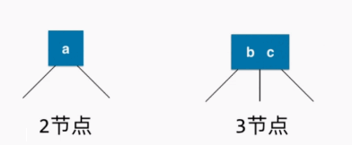
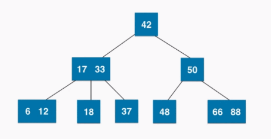
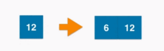
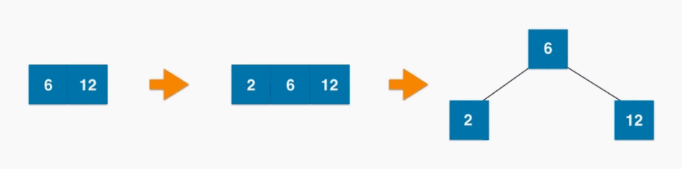
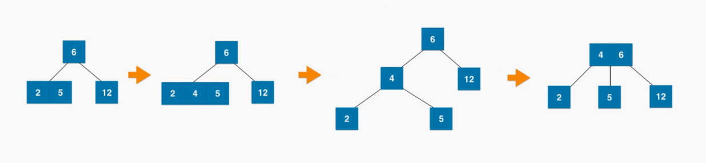
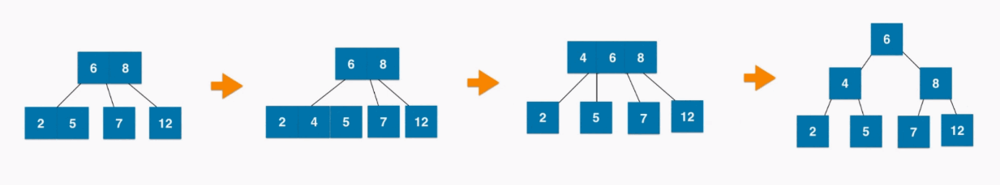
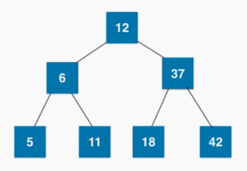

## 2-3 树

### 概念

满足二分搜索树的基本性质

节点可以存放一个或者两个元素, 即都是 2 结点或者 3 结点(有两个孩子或者三个孩子)

###### 如图

**2 结点** : 一个结点拥有 **一个数据域和两个子节点指针**

- 当前节点的数据的值要大于左子树中所有节点的数据，要小于右子树中所有节点的数据
- 两个子节点要么为空，要么也是一个 2-3 树

**3 结点** : 一个结点拥有 **两个数据域 b和 c和三个子节点指针**

- 左子树中所有的节点数据要小于 b中子树中所有节点数据要大于 b而小于 c，右子树中所有节点数据要大于 c
- 三个子节点要么为空，要么也是一个 2-3 树

###### 举例

**注意:** 2-3树是一棵绝对平衡的树

### 维护 2-3树绝对平衡

#### 如果插入 2- 节点

插入结点 6, 2-结点变为 3-结点

#### 如果插入 3- 节点

##### 1. 如果是根节点(无父亲结点)

插入结点 2

##### 2. 父亲节点为 2-节点

插入结点 4

##### 3. 父亲节点为 3-节点

#### 练习

插入

42, 37, 12, 18, 6, 11, 5

##### 结果

